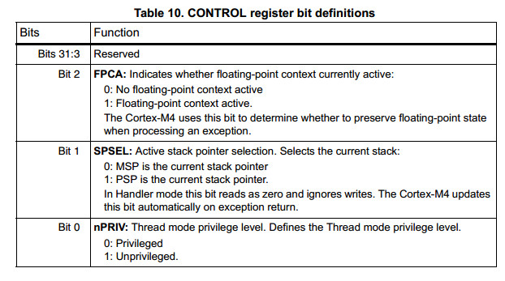

## STM32F4 programming manual_1

### 1. 处理器模式与特权等级

处理器模式分为以下两种：

- 线程模式：
用来执行应用软件；
处理器从reset出来时，进入线程模式；
CONTROL寄存器控制软件的执行状态时特权的还是非特权的。

- 处理模式：
用来处理异常；
完成异常处理后，进入线程模式；
该模式下，软件运行在特权等级上。

特权等级有以下两种：

- 非特权：
对于MSR、MRS指令受限的权限，不能使用CPS指令；
不能使用系统定时器、NVIC、系统控制块；
对于部分内存和外设的访问受限
必须使用SVC指令来执行超级访问者调用以控制特权等级的软件

- 特权：
可以使用所有指令，访问所有资源。
可以写CONTROL寄存器来改变软件执行的特权等级。

### 2. 栈

处理器使用向下增长的栈，这意味着栈指针指向栈内存的最后一个成员。当处理器将数据压入栈时，首先将栈指针减小相应的字节数，然后将数据写入栈指针所指的内存地址。处理器使用了两个的栈**main stack**和**process stack**，他俩拥有栈指针的独立拷贝。

在线程模式下，CONTROL寄存器控制处理器使用哪个栈(main stack or process stack)。在处理模式下，处理器总是使用 main stack。

| 处理器模式 | 用途 | 特权等级 | 栈 |
| ----- | -- | ---- | - |
| 线程模式 | 运行应用 | 特权 或 非特权 | main stack or process stack |
| 处理模式 | 处理异常 | 总是特权 | main stack |

### 3. 核心寄存器

- 通用寄存器
R0-R12 是32位通用寄存器，其中R0-R3四个寄存器可用于参数传递与结果返回。

- 栈指针SP
R13用于存储栈指针，在线程模式下，CONTROL寄存器的bit[1]表示使用哪个栈(main stack or process stack)。
bit[1] = 0: 使用主栈main stack pointor（MSP）， 这是reset时设置的值，也就是默认值。
bit[1] = 1：使用process stack pointor（PSP）
reset时，MSP被装载0x00000000.

- 链接寄存器LR
R14用于存储链接指针，主要是在发生函数调用的场合，LR寄存器存储子函数的返回地址。发生指令跳转时，如BL指令，首先将PC中地址存入LR寄存器中，然后将跳转目的地址存到PC中。
reset时，该值被置为0xFFFFFFFFF.

- 程序计数器PC
R15用于存储当前程序地址，reset时该寄存器装载reset向量的地址，这在地址 0x00000004的位置。
reset时，bit[0]的值被装载到EPSR的T位，而且必须为1。

- 程序状态寄存器PSR，该寄存器内存在几个互斥的位域可分别用以下寄存器表示。（同一个物理地址，几个不同名字）
应用程序状态寄存器 APSR
中断程序状态寄存器 IPSR
异常程序状态寄存器 EPSR

- CONTROL 寄存器
该寄存器控制在线程模式下使用哪个栈以及软件运行的特权等级
指示FPU状态是否激活

处理模式下，处理器总是使用MSP的，因此处理器会忽略对寄存器bit[1]的写入操作。

在OS环境中，建议线程运行在线程模式下使用PSP（process stack）；kernel和异常处理使用MSP（main stack）。

默认情况下，线程模式使用MSP（main stack）。可以通过下面两种方式将栈指针切换到PSP。

- 使用MSR指令，将CONTROL寄存器的bit[1]设置为1
- 异常返回到线程模式时，使用一个合适的EXC_RETURN值。

当改变栈指针时，软件必须在使用MSR指令后，立即使用ISB指令。这保证了ISB指令之后的指令使用新的栈指针。

	ISR指令是指令同步屏障（instruction synchronization barrier），它刷新了处理器的管道线，导致该指令之后的指令都要重新fetch。这条指令不会改变标志位。
	
### The Cortex microcontroller software interface standard (CMSIS)

该标准定义了如下内容

- 访问外设的方式
- 定义异常向量的方式
- 核心外设寄存器的名字
- 核心异常向量的名字
- 使用RTOS内核的设备无关接口，包括调试模式

CMSIS包含了Cortex-M4处理器核心外设的地址和数据结构定义

简化了软件开发过程

