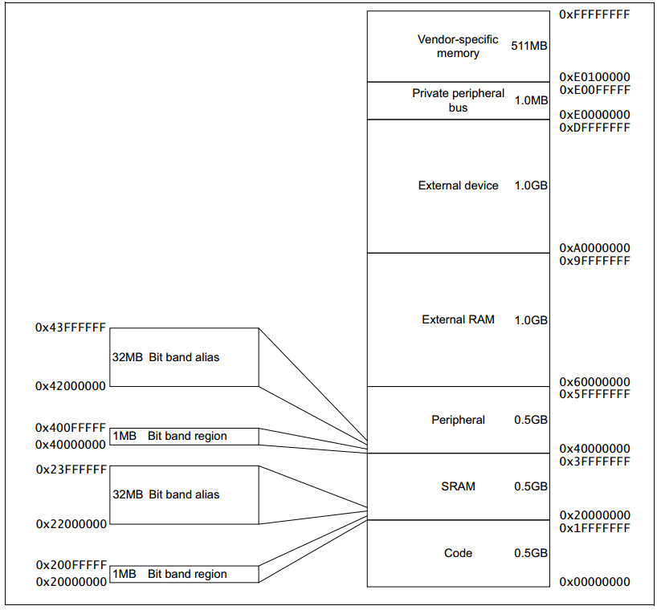
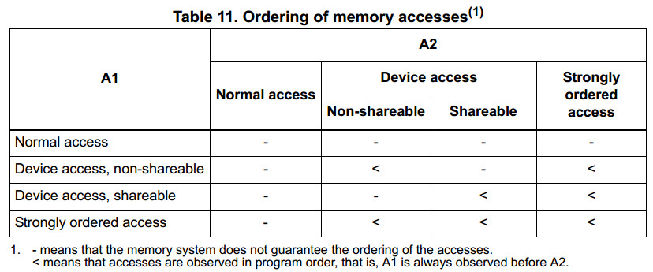
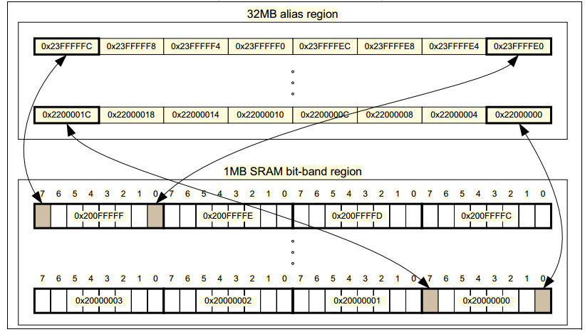

## STM32F4编程手册学习2_内存模型

### 1. 内存映射

MCU将资源映射到一段固定的4GB可寻址内存上，如下图所示。

内存映射将内存分为几块区域，每一块区域都有一个定义的内存类型，一些区域还有一些附加的内存类型。

内存类型有以下几种：

- **Normal**
处理器可以为了性能而对访问该区域的任务进行重排序。

- **Device**
处理器保证访问该内存的任务与其他访问Device或者Stronly-ordered内存的任务相对顺序不变。

- **Stronly-ordered**
处理器保证该访问该内存的任务与所有其他任务保持相对顺序。

- **Execute Never（XN）**
处理器避免对此的指令访问，任何试图从该区域预取指令的操作都将造成一个内存管理错误异常。

### 2. 内存访问顺序

对于大多数由显示内存指令访问指令所引起的内存访问而言，系统不会保证访问完成的顺序与程序中顺序一致。如果程序的执行依赖于两次内存完成的顺序，那么应该使用内存屏障指令，来保证内存访问按照程序代码中的顺序执行。

然而，内存系统可以保证，一些对Device 和Strongly-ordered内存的访问操作按顺序执行。如下表所示，其中A1、A2分别表示两次内存访问操作指令，“<” 表示A1先与A2执行，“-” 表示两者顺序不确定。

内存访问屏障有DMB, DSB, ISB三种，如下表所示

| 指令 | 描述 |
| -- | -- |
| DMB | Data Memory Barrier, 保证此指令之前的内存任务执行完毕，才会执行后续的内存任务。 |
| DSB | Data Synchronization Barrier, 保证此指令之前的内存任务执行完毕，之后才会执行后续指令。 |
| DMB |  Instruction Synchronization Barrier, 保证所有已经完成的内存任务可以被后续指令识别。 |

下面是几个使用内存屏障的例子：

- **向量表**
如果程序改变了向量表某一项的入口，之后使能了对应异常。那么在使能异常之前，需要使用DMB指令，以保证异常进入的是新的异常向量表。

- **Self-Modifying code**
如果程序包含Self-Modifying code代码，在代码修改后需要立即需要使用ISB指令，以保证后续指令使用了新的程序代码。

- **memory map switching**
如果系统支持内存映射变换机制，那么需要在内存映射变化后使用DSB，以保证后续程序使用更新后的内存映射。

- **动态异常优先级更改**
如果在一个异常正在执行或者就绪状态时，该异常优先级更改了，应该使用DSB指令，以保证改变生效。

访问Strongly-ordered 内存不需要使用DMB指令。

### 3. 内存访问行为

| 内存地址 | 内存区域 | 内存类型 | XN | 描述 |
| ---- | ---- | ---- | -- | -- |
| 0x00000000-0x1FFFFFFF | Code | Normal | - | 程序代码的可执行区域，数据也可以放在这里 |
| 0x20000000-0x3FFFFFFF | SRAM | Normal | - | 数据的可执行区域 代码也可以放在这里， 该区域包括位带及位带别名区 |
| 0x40000000-0x5FFFFFFF | Peripheral | Device | XN | 外设区，该区域包括位带及位带别名区 |
| 0x60000000-0x9FFFFFFF | External RAM | Normal | - | 数据外部存储区 |
| 0xA0000000-0xDFFFFFFF | External Device | Device | XN | 外部设备区 |
| 0xED000000-0xED0FFFFF | Private Peripheral BUS | Stronly-ordered | XN | 此区域报刊NVIC、系统定时器、系统控制块 |
| 0xED100000-0xFFFFFFFF | Memory mapped peripherals | Device | XN | 这个区域包含STM32标准外设 |

Code, SRAM, exteral RAM都可以保存程序，建议程序指令保存在Code区域。

#### 3.1 bit-band 位带

位带是指将位带别名区的一个字映射到位带区域的一个位上，如下图所示。位带区域占据SRAM和外设区的最低1M字节的地方。

向别名区写一个字更新了位带区的一个对应的位。别名区一个字的bit[0]决定了对应位的值， 而其他位bit[31；1]则对位带区没有什么影响。所以写0xFF跟写0x01对位带区的影响是一样的。

**本文图表引用自[《PM0214: STM32F3, STM32F4 and STM32L4 Series Cortex®-M4 programming manual》](http://www.st.com/content/ccc/resource/technical/document/programming_manual/6c/3a/cb/e7/e4/ea/44/9b/DM00046982.pdf/files/DM00046982.pdf/jcr:content/translations/en.DM00046982.pdf)**

**本文参考ST官方文档[《PM0214: STM32F3, STM32F4 and STM32L4 Series Cortex®-M4 programming manual》](http://www.st.com/content/ccc/resource/technical/document/programming_manual/6c/3a/cb/e7/e4/ea/44/9b/DM00046982.pdf/files/DM00046982.pdf/jcr:content/translations/en.DM00046982.pdf)**

