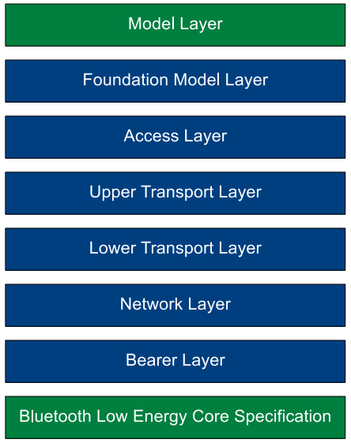
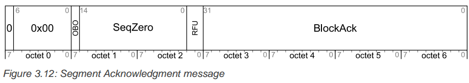
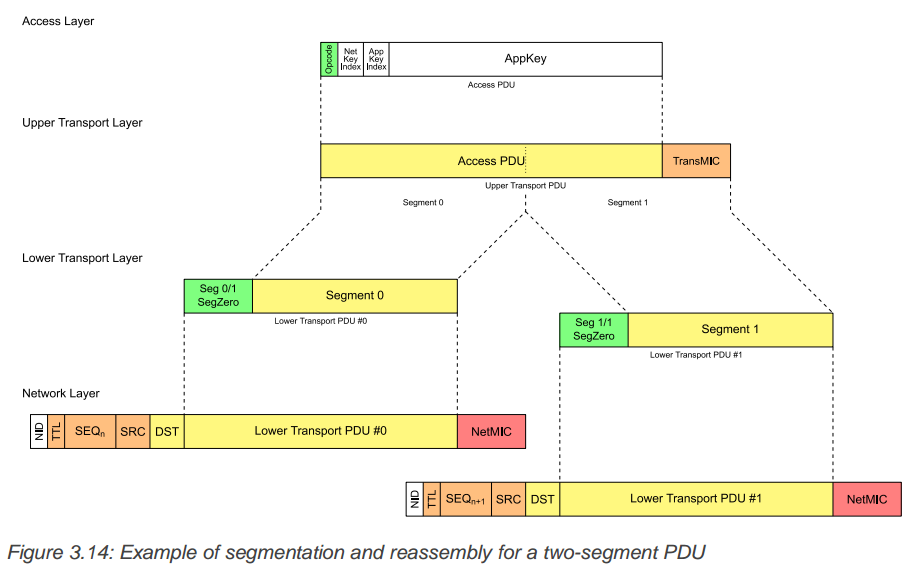

## 3. Mesh Networking

[TOC]

本部分以mesh网络的分层结构的顺序自下而上地介绍mesh网络。mesh网络结构如下所示：

### 3.1 Bearers 承载层

本规范定义了两种承载层：

+ **Advertising bearer**
+ **GATT bearer**

#### 3.1.1 Advertising bearer

使用 advertising bearer 时，mesh数据包可以使用Advertising Data发送，BLE advertising PDU使用 Mesh Message AD Type标识。

| Length | AD Type | Contens |
| - | - | - | 
| 0xXX | Mesh Message | network PDU |

任何使用Mesh Message AD Type的广播消息应该是无需连接（ non-connectable）、无需扫描的（ non-scannable） 非直接广告事件。如果一个节点在一个连接的或者扫描的广告事件中收到了一个Mesh Message AD Type 消息， 那么该消息会被忽略。

一个只支持 advertising bearer的设备应该使用尽可能高的占空比（接近100%）来扫描消息，以避免遗失消息或者Provisioning PDUs。

所有设备都应该支持GAP Observer role 和 GAP Broadcaster role。

#### 3.1.2 GATT bearer

GATT bearer可以使那些不支持advertising bearer的设备可以加入到mesh网中，GATT bearer 使用Proxy protocol通过GATT连接在设备之间转发、接受Proxy PDUs。

The GATT bearer uses a characteristic to write to and receive notifications of mesh messages using the attribute protocol.（这句话没理解什么意思）

GATT bearer定义了两种角色，分别是Client 和 Server。GATT Bearer Server应该实例化一个且只能一个 Mesh Proxy Service，GATT Bearer Client 应该支持Mesh Proxy Service。

### 3.2  Network Layer 网络层

网路层定义了可以使Lower Transport PDUs被bearer层转发的 Network PDU格式。网络层将从input interface收到的incoming消息进行解密（decrypt）、授权(anthenticate)并转发向output interface 或是更高的层级；将outgoing消息进行加密、授权并转发到其他网络接口。

#### 3.2.1 字节序

该层使用大端字节序

#### 3.2.2 地址

地址是16bit长度的值(两个字节），如下所示：

| 地址二进制值 | 地址类型 |
| - | - |
| 0b0000000000000000 | 未分配地址 |
| 0b0xxxxxxxxxxxxxxx（0x0000除外） | unicast address |
| 0b10xxxxxxxxxxxxxx | virtual address |
| ob11xxxxxxxxxxxxxx | group address |

##### 3.2.2.1 未分配地址

未分配地址是当一个节点的element还没有配置或者还没有分配地址时的一个地址。当不需要发布消息时，可以将publish address设置为unassigned address。

##### 3.2.2.2 Unicast address

unicast address是分配给每一个element的唯一地址，取值范围是0x0001到0x7FFF。unicast address在一个节点的生命周期中保持不变。unicast地址被用作消息的源地址，也可能用于消息的目的地址。如果一个消息是发往一个unicast 地址，那么该消息最多被一个element处理。

##### 3.2.2.3 虚拟地址

虚拟地址代表一系列的目的地址，每一个虚拟地址逻辑上代表一个128-bit的标签UUID。一个或多个element可能发布或订阅一个标签UUID， 标签UUID不被传递，应该被当作消息完整性检查值的附加域。

虚拟地址的15bit被设置为1, 14bit设置为0, 13~0bit是一个hash值。这个哈希值派生于UUID。

当一个发往虚拟地址的Access消息收到时，每一个匹配该虚拟地址的UUID都会被upper transport层用来当作附加唉的数据作为认证消息的一部分。

控制消息(control message)不可以使用虚拟地址。

##### 3.2.2.4 group address

Group address 是一个被写入0个或多个element的地址。地址位的15bit 14bit均被设置为1.

Group address只能被用作目的地址，被发往group address的消息被发送到所有订阅该group address的modale interfaces。

group address分为两种，一种是动态分配的，另一种是固定的。

| 地址值 | Fixed Group Address |
| - | - | 
| 0xFF00-0XFFFB | 	RFU	|
| 0xFFFC | all-proxies |
| 0xFFFD | all-friends |
| 0xFFFE | all-relays |
| 0xFFFF | all-nodes |

### 3.2.3 Address validity 地址有效性

| 地址类型 | 源地址 | control message 目的地址 | access message 目的地址 |
| - | - | - | - | 
| 未分配地址 | NO | NO | NO |
| unicast address | yes | yes |yes |
| virtual address | no | no | no |
| group address | no | yes | yes |

下表表示地址是否可以使用device key 或者是 application key： 

| 地址类型 | Device Key 有效 | Application Key 有效 |
| - | - | - |
| unassigned address | no | no |
| unicast address | yes | yes |
| virtual address | no | yes |
| group address | no | yes |

### 3.2.4 Network PDU

Network PDU的结构定义如下表所示：

| filed | bits | notes |
| - | - | - |
| IVI | 1 | Least significant bit of IV Index |
| NID | 7 | Value derived from the NetKey used to identify the Encryption Key and Privacy Key used to secure this PDU |
| CTL | 1 | Network control |
| TTL | 7 | Time to live |
| SEQ | 24 | Sequence Number |
| SRC | 16 | 源地址 |
| DST | 16 | 目的地址  |
| TransportPDU | 8 to 128 | 传输单元 |
| NetMIC | 32 or 64 | 网络层信息完整性检查 |

#### 3.2.4.1 IVI

IVI是 用来认证加密Network PDU的IV Index的最低位。

#### 3.2.4.2 NID

 NID域包含一个7bit的 network identifier，用来提供一种简单的方式查找加密认证Network PDU所使用的Encryption Key和Privacy Key。

NID是派生于Network Key，与Encryption Key和Privacy Key关联。

#### 3.2.4.3 CTL

CTL位判断消息是否是控制消息，当该位是1时，表示消息是control message。该位为0,则表示消息位access message。

当CTL为0时，NetMIC是32-bit的值，下传输层包含access message。

当CTL为1时，NetMIC是64-bit的值，下传输层包含control message。

#### 3.2.4.4 TTL

TTL是一个7-bit的值，表示消息跳转的次数。

	0=没有被中继且不会被中继。
	1=已经被中继过，不会再次中继
	2~126 = 可能被中继过，仍将继续中继
	127= 没有被中继，可以被中继
	
#### 3.2.4.5 SEQ

该成员是一个24-bit的值，由IV index组成，对于每一个network PDU来说，这是一个由节点产生的唯一的值。

#### 3.2.4.6 SRC

源地址，必须是unicast address。可以根据源地址识别产生该消息的element。

源地址由产生该消息的element设置，并且在传输过程中不会被中继节点接触（可以理解为对中继节点不可见？）。

#### 3.2.4.7 DST

目的地址，16-bit值，可以时unicast address、virtual address、group address。

在传输过程中，不会被中继节点的网络层接触（理解为对中继节点网络层不可见）。

#### 3.2.4.8 Transport PDU

传输的字节数据，当CTL设置为1时，该域最大96 bit。当CTL为0时，最大长度为128 Bits。

Transport PDU 是被产生该消息的下传输层设置，不能被网络层改变。

#### 3.2.4.9 NetMIC

该域长度取决于CTL，当CTL为0时，该域为64-bit；当CTL为1时，该域为32-bit。

NetMIC用于确认DST和Transport PDU没有被破坏。

NetMIC会被每一个传输、中继该消息的节点的网络层设置。

#### 3.2.5 Network Interfaces

网络层支持通过多个承载层来收发消息，每个bearer可以通过network interfaces与网络层连接。同一个节点内部的不同element间的消息传送是通过local interfaces实现的。

举个例子，比如一个节点可能存在三个interfaces，一个用来通过advertising bearers收发消息；另外两个通过GATT bearers收发消息。

Interface 可以提供filter（过滤器）用来控制消息的进出规则。

#### 3.2.5.1 Interface input filter

用来确定进来的消息是丢弃还是传送到网络层。

#### 3.2.5.2 Interface output filter 

用来确定出去的消息是被丢弃还是被传送到承载层。

当TTL的值为1时，会丢弃所有要传送到承载层的消息。

#### 3.2.5.3 Local network interface

这用来在一个节点内部的不同element之间传送消息。当该interface受到消息时，会将消息传送到节点内的所有element.

#### 3.2.5.4 Advertising bearer network interfaces

该interface允许通过advertising bearer传送消息。

当收到一个消息且消息没有被标记中继消息时，Advertising bearer network interface会使用Network Transmit state的值在advertisng bearer上传送该消息。

当收到一个消息且被标记为中继消息，Advertising bearer network interface会使用Relay Transmit state的值在advertisng bearer上传送该消息。

### 3.2.6 Network layer behavior

#### 3.2.6.1 Relay feature

中继特性指的是将从advertising bearer收到的Network PDU进行转发。该特性是选配的，可以启用或者不启用。如果支持代理特性，那么节点应该同时支持GATT和advertising两种bearer(承载层)。

#### 3.2.6.2 Proxy feature

用来转发在GATT和advertising bearer之间传送的消息。

#### 3.2.6.3 接收network PDU

消息是通过network interface从bearer layer 传送到network layer。网络层可以对消息标记一些附加的标签，以供后续使用。

当网络层收到消息时，会首先检查NID的值是否匹配已知的NID值，若不匹配则忽略该消息。若可以匹配已知的NID，则节点会根据相匹配的Network Key来认证该消息。如果认证成功，而且SRC、DST是有效的，且网络层消息缓存中没有该消息，那么消息会被传送到下传输层被继续处理。

消息被转发时，其中的IV index应该与收到时保持一致。

如果从advertising bearer传送过来的消息被传送到下传输层处理，且节点支持中继特性（并使能），TTL不小于2，目的地址不是本节点的unicast address，那么TTL的值减1，Network PDU被标记为relay，Network PDU被重发向所有连接到advertising bearer的网络接口（network interfaces）。建议在收到Network PDU后，加一个任意时间的小延时，再进行转发。这样可以避免多次中继同时发生。

如果从GATT承载层传过来的消息被传送到下传输层处理，节点支持并使能了代理特性，TTL不小于2，目的地址不是本节点的unicast，那么TTL减1，并且Network PDU重发到所有的network interfaces。

如果从advertsing bearer传过来的消息被下传输层处理，并且代理特性被支持使能，TTL不小于2，目的地址不是本节点的unicast address，那么TTL减1，并且Network PDU将会被重发到所有连接GATT bearer的网络接口。

### 3.3 Lower Transport Layer 下传输层

下传输层从上传输层获取Upper Transport PDU，并将其转发至对等的下传输层。这些Upper Transport PDU可以被装进一个单独的Lowwer Transport PDU，也可能被分割为多个。当下传输层受到消息时，会处理Lower Transport PDUs，将重组分片的PDU，一旦完成便将PDU发送到上传输层。

#### 3.3.1 字节序

该层使用大端

#### 3.3.2 Lower Transport PDU

Lower Transport PDU 用来转发上传输层PDU到其他节点。下传输层PDU最高位是SEG域，SEG用来确定PDU是否被分片。如下表所示：

| CTL | SEG | Lower Transport PDU |
| - | - | - |
| 0 | 0 | 未分片access message |
| 0 | 1 | 分片的access message |
| 1 | 0 | 未分片的control message |
| 1 | 1 | 分片的control message |

#### 3.3.2.1  Unsegmented Access message

数据格式如下：

| Field | Size(bits) | Notes |
| - | - | - |
| SEG | 1 | 0=Unsegmented, 1=segmented |
| AKF | 1 | Applicatoin Key Flag |
| AID | 6 | application Key identifier |
| Upper Transport Access PDU | 40 to 120 | 上传输层PDU |

AKF和AID是被上传输层根据application key 或 device key设置的，用来加密access payload。

这时消息是没有SZMIC域的，因为上传输层的TransMIC是32-bit的，SZMIC是0，也就不需要单独设置了。

#### 3.3.2.2 Segmented Access message

数据格式如下：

| Field | Size(bits) | Notes |
| - | - | - |
| SEG | 1 | 0=Unsegmented, 1=segmented |
| AKF | 1 | Applicatoin Key Flag |
| AID | 6 | application Key identifier |
| SZMIC | 1 | Size of TransMIC |
| SegZero | 13 | Least signification bits of SeqAuth |
| SegO | 5 | Segment Offset number |
| SegN | 5 | Last Segment number |
| Segment m | 8 to 96 | Segment m of the Upper Transport Access PDU |

SZMIC表示上传输层PDU中TransMIC的size。0表示TransMIC是32-bit，1表示64-bit。

AKF和AID是被上传输层根据application key 或 device key设置的，用来加密access payload。

SeqZero是被上传输层设置的。

SegO域说明这是第几个分片，SegN表示总共有多少个分片。

Segment m就表示第m个分片的上传层PDU数据。

Access message中除了最后一个分片，其他所有分片都应该是12字节的（12*m 到 12*m+11）。最后一个分片就是从12*m到PDU最后

**Access Message的分片应该是12个字节划分一次**

同一个上传输层PDU分片产生的下传输层PDU应该具有相同的AKF, AID, SZMIC, SeqZero, and SegN。

#### 3.3.2.3 Unsegmented Control Message

Unsegmented Control Message 用来传输*Segmented Acknowledgment message*或者是Control message。

结构如下所示：

| Feild | Size(bits) | note |
| - | - | - |
| SEG | 1 | 0=Unsegmented, 1=segmented |
| Opcode | 7 | 0x00 = Segment Acknowlegment ; 0x01 to 0x7F = Opcode of Transport Control message |
| Paramenters | 0 to 88 | Parameters for the Transport Control message |

##### 3.3.2.3.1 Segmented Acknowledgment message

Segmented Acknowledgment message是下传输层用来确认分片收到的。

 

| Feild | Size(bits) | note |
| - | - | - |
| SEG | 1 | 0=Unsegmented, 1=segmented |
| Opcode | 7 | 0x00 = segment acknowledgment message |
| OBO | 1 | Friend on behalf of a Low Power node |
| SegZero | 13 | SeqZero of the Upper Transport PDU |
| RFU | 2 | Reserved for Future Use |
| BlockAck | 32 | Block acknowledgment for segments |

SEG为0

Opcode为0x00

如果消息是被目的地址的节点收到，则OBO为0；如果消息的目的地址的节点是一个低功耗节点，那么消息是被节点的友好节点收到的，这时OBO为1。

BlockAck用来表示分片收到的情况，最低位 bit 0 代表segment 0，最高位代表segment 31。如果bit n被设置为1，说明segment被节点收到了（或被低功耗节点的友好节点收到了）。

#### 3.3.2.4 Segmented Control message

数据格式如下：

| Field | Size(bits) | Notes |
| - | - | - |
| SEG | 1 | 0=Unsegmented, 1=segmented |
| Opcode | 7 |  0x00 = Segment Acknowlegment ; 0x01 to 0x7F = Opcode of Transport Control message |
| RFU | 1 | 留给以后使用，保留位 |
| SegZero | 13 | Least signification bits of SeqAuth |
| SegO | 5 | Segment Offset number |
| SegN | 5 | Last Segment number |
| Segment m | 8 to 64 | Segment m of the Upper Transport Control PDU |

SEG设为1

Opcode 被上传输层设置，用来表示parameters的格式。

The SeqZero field shall be set by the upper transport layer.

The Segment m field shall be set to the subset of octets from the Upper Transport Control PDU. Segment
m shall be octets 8*m to 8*m+7, except for the last segment where it is 8*m to the end of the message.**也就是说控制消息的分片长度是8个字节。**

来自同一个上传输层PDU的分片具有一致的Opcode, SeqZero, and SegN。

#### 3.3.3 分片和重组

为了传输大于15个字节的上传输层PDU，下传输层会将PDU分片、重组，然后被发送到同级的下传输层上。传输分片时，会使用block acknowledgment message来减小下传输层所传输信息的大小。

 

##### 3.3.3.1 分割

下传输层可以将来自上传输层的PDU分片发送，需要注意的是，下传输层一次只能发送来自同一个上传输层PDU的分片。也就是说，只有当当前上传输层PDU的分片全部发送完必，并且收到对应的acknowledgment之后，才会发送下一个上传输层PDU的分片。还有一种情况就是，当前PDU分片发送被取消，这时会继续发送下一个PDU分片的发送。

当上传输层PDU可以装入一个未分片的下传输层PDU时，那么下传输层可以直接使用未分片喜爱哦戏传输该消息。如果上传输层PDU装入一个单一的分片下传输层PDU（就是只分了1个segment的分片消息），那么消息就可以使用单一分片的消息来传输该消息。

分片信息发送会有acknowledgment确认，但是未分片消息是没有的。因此一个使用单一分片来发送上传输层PDU比起使用未分片消息更加有效。

Each segment of the Upper Transport Access PDU shall be **12 octets** long with the exception of the last segment, which may be shorter

Each segment of the Upper Transport Control PDU shall be **8 octets** long with the exception of the last segment, which may be shorter.

分片的消息是通过SegO来识别的，通过SeqAuth来连接并认证。来源于同一个上传输层PDU的分片消息，都有小爱嗯他的IV index和SeqAuth值，这涌来加密和认证上传输层PDU。

SeqAuth是由IV index和第一个分片的sequence number(SEQ)组成的，是一个56-bit的值，其中IV index是其中的高位的字节，sequence number(SEQ)是其中的低位。只有最低13 bits(就是SeqZero）被包含进了分片消息。当重组一个完整的分片消息时，SeqAuth值可以从IV index、SeqZero和SEQ所派生出来。

举个例子，如果收到消息的SEQ是0x6471262，IV index是0x58437AF2，SeqZero是0x1849，那么SeqAuth就是0x58437AF2645849。

##### 3.3.3.2 重组

收到分片消息时，接收节点将会检查SeqAuth以确认对应的上传输层PDU是否被收到过。如果分片消息没有被收到过，那么接收的设备将会根据消息中的SegN字段来分配足够的内存，以存储上传输层的各个分片信息。

如果节点不支持低功耗特性，并且消息是发往一个unicast address，而此时节点不能接收该上传输层PDU（可能因为节点正忙，或是资源不足以重组该消息），那么节点将会通知该消息的源节点，通过发送一个BlockAck 0X00000000。

如果分片消息正在被处理，SegO字段决定分片重组时的位置，接收者将会更新BlockAck值来报告此分片发送成功。

##### 3.3.3.3 segmentation behavior 分片表现

如果消息的目的地址是一个unicast address，那么下传输层会等待一个目的节点的Segment Acknoeledgment message，如果目的节点是一个低功耗节点，那么Segment Acknoeledgment message由其友好节点发送。

如果消息是被发往一个group address或者是一个虚拟地址的，那么下传输层会发送所有上传输层PDU对应的分片下传输层PDU。**建议多次发送下传输层PDU，发送间隙引入随即的延时**

被发往group或者虚拟地址的上传输层PDU，不会收到acknowledgment，因此发送之后的状态是不知道。因此多发送几次可以确保成功发送的概率。

当下传输层PDU发送时，一个定时器将会被设置用以等待Segment Acknowledgment message ，定时器的最小值为*200+50\*TTL*毫秒。

当收到一个确认分片收到的Segment Acknowledgment message时，下传输层将会重置定时器，并重新发送未确认的下传输层PDU分片。当收到Segment Acknowledgment message确认所有的分片都已成功接收后，上传输层PDU就发送成功啦。如果收到的Segment Acknowledgment message中BlockAck是0x00000000，那么上传输层会取消该消息的发送并通知更高层级该事件。

 如果没有收到Segment Acknowledgment message确认，分片的下传输层PDU至少应该重传送两次。弱国下传输层在所有分片确认前停止了重传，那么上传输层PDU消息就被取消了。
 
 

##### 3.3.3.4 Reassembly behavior 重组表现

下传输层有一个sequence authentication value（SeqAuth），每个源节点设备有一个与之对应的block acknowledgment value。

如果下传输层收到一个分片消息，但是消息的SeqAuth值比当前的sequence authentication value值小，那么就会忽略该消息。如果下传输层收到一个新的消息，那么就会将消息中的SeqAuth保存为新的sequence authentication value。

Sequence authentication value逻辑上包含了IV index，因此如果下传输层收到了的消息是使用之前的IV index的，那么该消息的SeqAuth值就会比当前的sequence authentication value小。

如果下传输层收到一个分片消息，但是节点不能接收该多片消息（可能因为节点繁忙或是内存不足以容纳多篇消息等原因），如果消息是发往一个unicast address，那么下传输层就会返回一个Segment Acknowledgment message，其中 BlockAck 设置为 0x00000000。

如果下传输层收到的分片消息中SeqAuth值比当前的sequence authentication value要大，那么下传输层就会启动一个“不完整计时器”，该定时器定义了下传输层等待具备相同SeqAuth值消息的时间，最小为10秒。

如果下传输层收到的分片消息中SeqAuth值比当前的sequence authentication value要大，同时消息的目的地址是一个unicast address，那么下传输层就会启动一个acknowledgment定时器，该定时器定义了下传输层发送Segment Acknowledgment message的时间，最小设置为 *150+50\*TTL*毫秒。

如果下传输层收到另一个对应当前 sequence authentication value的消息片，且此时acknowledgment定时器未活动，那么就会重启acknowledgment定时器。

如果下传输层收到对应当前 sequence authentication value的消息片，且此时不完整计时器正在活动，那么重启该定时器。

下传输层会在block acknowledgment value中标记每一个片段，以便于后面将其发送给源节点。

当某个消息的所有片段都收到后，下传输层会发送确认消息给源节点，并去取消不完整定时器和acknowledgment定时器，然后向上传输层发送重组消息。

如果acknowledgment定时器超时，下传输层会发送一个Segment Acknowledgment message给源节点。

如果不完整计时器超时，下传输层会认为消息接受失败，取消acknowledgment定时器。任何分片消息会被忽略。

如果下传输层收到了其他消息片段，而此时分片的消息已经全部收到了，那么将会给源节点发送Segment Acknowledgment message。如果节点是作为一个低功耗节点的友好节点存在的，那么Segment Acknowledgment message中的OBO字段会被设置为1。表示消息已经缓存在友好节点的队列中等待低功耗节点来轮询获取了。反之，则OBO设置为1。

#### 3.3.4 Friend Queue

友好节点对每一个与其建立联系的低功耗节点都有一个友好队列（Friend Queue），这个友好队列就存储了以低功耗节点为目的地址的消息，等待低功耗节点来轮询请求。

当一个友好节点收到消息，且该消息是发往一个与之建立联系的低功耗节点，消息中的TTL字段不小于2，那么TTL的值减1，然后消息存储在该友好节点的友好队列中。

如果消息是分片的，消息会先在上传输层完成重组，友好节点向源节点发送Segment Acknowledgment message确认消息，然后才会将消息存储到友好队列中。

如果友好队列满了，并且新消息需要被保存，那么最老的消息将会被覆盖，以为新消息腾出地方。（**这句话可能理解的不对，原文是下面一段话**）

If the Friend Queue is full and a new message needs to be stored that is not a Friend Update message, the oldest entries other than a Friend Update message shall be discarded to make room for the new message.

如果要被存储的消息是一个 Segment Acknowledgment 消息，并且友好队列中已经有一个 Segment Acknowledgment 消息了，两消息的源地址、目的地址一样而且用着相同的SeqAuth值，但是IV或者是sequence number比老消息更小，那么老的消息将会被清除。

如果友好节点需要security更新，那么要向友好队列中添加一个Friend Update消息。

低功耗节点向友好节点发送Friend Poll消息时，若此时友好队列为空，那么需要友好节点向友好队列中添加一个Friend Update 消息，然后此消息就可以回应给低功耗节点啦。

### 3.4 Upper trnsport layer 上传输层

上传输层从访问层（access layer ）获取消息或者是自己生成上传输层控制消息（upper transport layer Control message ），并将这些消息传送给同级的上传输层。

对于从访问层获取的消息，消息的加密和认证是使用application key实现的。这允许上传输层认证收到的消息。

传输层控制消息是上传输层内部产生的，只能在网络层加密和认证。

#### 3.4.1 字节序

大端字节序

#### 3.4.2 Upper Transport Access PDU

在Network PDU中，当CTL字段是0时表示Upper Transport Access PDU中装的是从访问层获取的access payload。

access payload 使用application key或者device key加密，加密的access payload和相关的信息完整性检查值都放在Upper Transport Access PDU中。

| Field Name | Octects | Notes |
| - | - | - |
| Encrypted Access Payload | 1 to 380 | The encrypted access payload |
| TransMIC | 4 or 8 | The message integrity check value for the access payload |

##### 3.4.2.1 Encrypted access payload

Access payload是访问层提供的，如果TranMIC是32-bit的，access payload最长可以是380字节。如果TranMIC是64-bit的，access payload可以最长374字节。在上传输层中，access payload是不可见的，这个字段的所有信息都不能使用。

##### 3.4.2.2 TransMIC

信息完整性检查（ Message Integrity Check for Transport ，TransMIC）是一个32位或64位的数，用来认证access payload是否被破坏。对于分片消息（SEG=1），TransMIC的长度是由下传输层PDU中的SZMIC 字段决定的。对于未分片的消息，数据信息的TransMIC是32位的。

**注意：控制消息是没有TransMIC的**

#### 3.4.3 Upper Transport Control PDU

若CTL位是1，那么上传输层就装载一个控制消息。传输层控制消息有一个7位的操作码，该操作码用来定义参数的格式。操作码没有包含在参数字段中，但是在每一个分片或未分片的控制消息，其下传输层PDU中都有操作码。

下传输层可能会将消息分割个几个小的PDU，以便于在网络层传输。因此建议根据下面这个表的格式，保持传输控制PDU的大小，表中的值代表根据包的数量而建议的参数域最大的长度。（本段理解可能不对，原文如下）

The lower transport layer may segment messages into smaller PDUs for delivery over the network layer. It is therefore recommended to keep Transport Control PDU payload size as reflected in Table 3.16, where the values represent the maximum useful parameter field sizes depending on the number of packets.

| Numbers of Packets | Transpotr Control PDU Payload Size |
| - | - |
| 1 | 11(Unsegmented) |
| 1 | 8(segmented) |
| 2 | 16 |
| 3 | 24 |
| n | n*8 |
| 32 | 256 |

**Upper Transport Control PDU的最大长度是256字节**

#### 3.4.4 Upper transport layer behavior

##### 3.4.4.1 Transmitting an access payload

所有access message在application key或是device key的上下文中被传递。access payload使用application key 或者 device key 加密，TransMIC设置信息完整性检查的值。

Sequence number(SEQ) 会被发配到消息中，在被下传输层中分片的消息中，SEQ是SeqAuth的底24位。

下传输层PDU中的AKF和AID字段是根据application key 或者device key来设置的。如果一个application key被使用，那么AKF被设置为1，并且AID字段被设置为application key identifier（AID）。如果device key被使用，那么AKF字段被设置为0，且AID设置i为0b000000。

##### 3.4.4.2  Receiving an Upper Transport PDU

收到Receiving an Upper Transport  Access PDU时，access payload会被解密，TransMIC会被用来认证消息。如果PDU通过认证并通过完整性检查，该消息将会传送到access层。

#### 3.4.5 Transport Control messages

Transport Control messages可以通过分片的控制消息或是单一的未分片控制信息传送，不管用哪种方式，每个消息都有一个7位的操作码用来确定参数域的格式。每一个传输控制消息都应该以最小数量的下传输层PDU传送。

| Value | Opcode | Notes |
| - | - | - |
|0x00 | – | Reserved for lower transport layer |
| 0x01 | Friend Poll | Sent by a Low Power node to its Friend node to request any messages that it has stored for the Low Power node |
| 0x02 | Friend Update | Sent by a Friend node to a Low Power node to inform it about security updates |
| 0x03 | Friend Request | Sent by a Low Power node the all-friends fixed group address to start to find a friend |
| 0x04 | Friend Offer | Sent by a Friend node to a Low Power node to offer to become its friend |
| 0x05 | Friend Clear  | Sent to a Friend node to inform a previous friend of a Low Power node about the removal of a friendship |
| 0x06 | Friend Clear  Confirm | Sent from a previous friend to Friend node to confirm that a prior friend relationship has been removed |
| 0x07  | Friend Subscription List Add | Sent to a Friend node to add one or more addresses to the Friend Subscription List |
| 0x08  | Friend Subscription List Remove | Sent to a Friend node to remove one or more addresses from the Friend Subscription List |
| 0x09  | Friend Subscription List Confirm | Sent by a Friend node to confirm Friend Subscription List updates |
| 0x0A | Heartbeat | Sent by a node to let other nodes determine topology of a subnet |
| 0x0B–0x7F | RFU | Reserved for Future Use | 

### 3.5 Access Layer 访问层

#### 3.5.1 字节序

从本层级开始，字节序为小端字节序

#### 3.5.2 Model identifier 模型识别器

Model可以被唯一的识别器所识别，蓝牙官方组织定义的模型识别器是16位的，厂商定义的模型识别器是32位的，在SIG的基础上加入了16位的厂商信息。

#### 3.5.3 Access Payload

格式定义如下：

| Field Name | Size (octets) | Notes |
| - | - | - |
| Opcode | 1, 2, or 3 | Operation Code |
| Parameters | 0 to 379 | Application Parameters |

access payload最多被分割为32个12字节的片段（包含TranMIC字段），若TranMIC是4个字节长度，那么payload最长可以到达380字节，如果此时操作码只有一个字节的话，那么parameter字段的最大长度是379。

