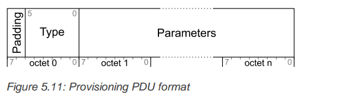

## Bluetooth Mesh Provisioning

[TOC]

Provisioning是将未配网设备加入到mesh网中的过程，该过程是通过provisioner来实现的。Provisioner向未配网设备提供provisioning 数据，其中包括network-key、当前网络的IV_Index，还有设备每一个element对应的unicast地址。

provisioner可以是手机或者其他智能设备，一个mesh网中只需要一个provisioner角色，但是亦可以允许多个provisioner实现，多个provisioner共存时的数据共享可以被特定实现。

provisioning过程，首先需要在未配网设备和provisioner节点间建立一个**provisioning-bearer**。未配网设备向provisioner广播自己的UUID以及其他必要信息。provisioner连续扫描消息，收到未配网设备的消息时，选择与某一个对应的设备建立**provisioning-bearer**。

**Provisioning-bearer**建立后，provisioner与为配网设备间使用Elliptic Curve Diffie-Hellman (ECDH)协议加密。

Provision协议使用分层的结构，如上图所示。设备的provision过程是通过发送provisioning-PDU实现的。provisioning-PDU通过*generic provision layer*层发往未配网设备。该层定义了provisioning-PDU是如何传输、分段重组的，传输包通过*provisioning-bearer*发送。*provisioning-bearer*定义了连接对话是如何建立的，即*generic provision layer*的传输包是怎样被传送到设备的。最后，在provision结构的最下层就是bearers。

### Provisioning bearer layer

*provisioning bearer layer*实现了在provision过程中*provisioning PDUs*的传输。mesh协议中定义了两种*provisioning bearers*

+ PB_ADV
+ PB_GATT

未配网设备可以支持PB_ADV或是PB_GATT，建议在未配网设备同时实现两种bearer。provisioner至少支持一种，强烈建议provisioner支持PB-ADV。

#### PB-ADV

PB-ADV是一个provisioning bearer，是用来在advertising channel上使用*Generic Provision PDUs*来进行provision的。provision机制是基于对话(session)的。一个未配网设备一次只能支持一个对话(session)，而对于provisioner则无此限制。

PB-ADV用来传输*Generic Provisioning PDUs*，PB-ADV bearer最大的传输单元（Maximum Transmission Unit, MTU）是24个字节。

支持PB-ADV的设备应该以占空比100%的频率扫描消息，以免丢失*Generic Provision PDUs*。

PB-ADV PDU 消息包的格式如下：

|  Feild | Size | Description |
| - | - | - |
| Length | 1 | length of the pb-adv PDU |
| AD type | 1 | PB_ADV |
| contents | 可变 | PDB-ADV PDU	|

其中PB-ADV PDU格式如下：

| Field | Size | Description |
| - | - | - |
| LInk ID | 4 | 一个link的标识符 |
| Transaction Number | 1 | The number for identifying a transaction |
| Generic Provisioning PDU | 1-24 | Generic Provisioning PDU being transferred |

LinkID 用来表示两个设备之间的一个连接。

Transaction Number 包含一个1-byte的值，用来表示每个*Generic Provisioning PDU*， 如果*Generic Provisioning PDU*经过了分段，则每个分片的Transaction Number 都是相同的。而且当*Generic Provisioning PDU*重发时，该值也是不变的。

在实现时还需要遵循以下几条规则：

+ 当PB-ADV PDU包含*Provisioning Bearer Control PDU*时， Transaction Number应该设置为0.
+ 当一个Provisioner通过一个打开的provision link，首次发送Provisioning PDU时，Transaction Number 的值应该从0x00开始，每发送一个Provisioning PDU该值累加。当到达0x7F时，返回的0.
+ 当未配网设备通过一个打开的provisin link首次发送PDU时，Transaction Number的值应该从0x80开始，每发送一个provisioning PDU累加1.当到达0xFF时，返回到0x80.
+ 当一个设备收到provisioning PDU时，将会根据收到包的Transaction Number值来设置该值。
+ 当一个设备发送Transaction响应PDU时， Transaction Number 值应该设置为其响应的那条消息的 Transaction Number 值。

#### PB-GATT

PB_GATT是通过Proxy PDU来provision的bearer，PB-GATT是用来支持那些不支持PB-ADV的provisioner的而实现的bearer.

关于GATT不太理解，后续在做整理。

### Generic Provisioning PDU

Generic Provisioning PDU包含两部分，一部是Generic Provisioning Control(GPC)field, 紧接着是Generic Provisioning Payload。

Generic ProvisionIng Control field的最低两位包含一个Generic Provisioning Control Format （GPCF）field，该值决定了PDU的类型。

| Value | Description |
| -| -|
| 0b00 | Transaction Start|
| 0b01| Transaction Acknowledgement |
| 0b10 | Trabsaction Continue |
| 0b11 | Transaction Bearer Control |

#### Generic Provisioning PDU

##### Transaction Start PDU 

Transaction Start PDU 用来开始一段分段消息传输，其格式如下：

##### Transaction Acknowledgment PDU

*Transaction Acknowledgment PDU*用来响应一个Provisioning PDU

该PDU只包含一个字节，如下所示：

此时*Generic Provisioning Payload*的长度是0.

##### Transaction Continuation PDU

Transaction Continuation PDU用来传输后续的provisioning PDU，其结构如下所示：

SegmentIndex是分段消息的index（从0开始）

GPCF为0b10

Generic Provisioning Payload 包含Provisioning PDU分段索引为SegmentIndex的内容。

##### Provisioning Bearer Control

Provisioning Bearer Control PDU用来管理bearer上的额对话（session），其格式如下：

###### Link Open Message

该消息用于打开一个连接，该消息需要使用Link-ACK-message来响应。

一个设备一次只能处理一个连接，当一个连接处于活动状态时，会忽略其他的Link-Open-message.

Link_Open_message消息的参数是需要建立连接的设备的UUID，如下所示：

###### Link ACK message

该消息用来响应Link-Open-message，没有参数，只有一个字节，如下所示：

###### Link Close message

该消息同来关闭一个连接，由于该消息是没有响应的，因此发送端需要重复发送该消息至少三次，连接两端都可以发送该消息，并处理该消息。

该消息的参数域描述关闭连接的原因，其结构如下：

| Field | Size | Description |
| - | - |- |
| Reason | 1 | The reason for closing the link |

其值为：

| Value | Reason | Notes |
| - | - | - |
| 0x00 | success | provisioning successful |
| 0x01 | Timeout | provisioning transaction timed out |
| 0x02 | Fail | The provisioning failed |
| 0x03 - 0xFF | Unrecognized | 未定义 |

#### Link Establishment procedure

Link Establishment procedure 用于建立一个对话（session）， 一个对话用Link ID 标识，在连接过程中该值不会变化。LinkID需要随机生成，以避免多个对话间冲突。

连接建立时，未配网设备使用UUID标识，Provisioner扫描未配网设备的广播，然后provisioner发起Link-Open-message来建立连接。Link-Open-message中包含了未配网设备的UUID。在PB-ADV上的PB-ADV PDU包含了连接的Link ID.

对于一个没有配网并且已经收到了Provisioning Invite PDU的设备，当其周到一盒Link Open messsage时，会响应该消息返回一个带有相同LinkID的Link ACK message.

连接可以在任何时候通过发送Link Close message来关闭，连接的两端都可以发送该消息。

连接建立的流程可以用下图表示：

#### Generic Provisioning behavior

每个Generic Provisioning PDU发送时，要与上一个PDU有一个20~50毫秒的随机延时。

每个Provisioning PDU都应该作为一个独立的消息包，每个消息包由一个或多个分段组成。

Provisioning PDU被分段的数量，取决于该PDU的大小，segment Index可以是0~63之间的数。segment 0 应该使用Transaction Start PDU来发送。其他的分段应该使用Transaction Continue PDU来发送。每个分段都被放入Generic Provisioning Payload中。

每个bearer都有一个MTU最大值限制，每个Generic ProvisionIng PDU都应该是最长的MTU长度，最后一个分段除外。

发送端需要顺序发送每个分段，如果发送端没有收到回应，那么发送端会重发整个PDU的所有消息。

若果发送端收到了Transaction Acknowledgement message，则表示传输成功。

如果发送端在发送第一条消息后30秒内，没有收到Transaction Acknowledgement message，则发送端会取消传输，终止provision过程，关闭link。

接收端会根据Transaction Start PDU中的内容，判断分段的个数。

在PB-ADV bearer中，当接收端收到了所有的分段，它会计算收到Provisioning PDU的FCS，如果该值符合Transaction Start PDU中的FCS值，那么接收端就会在一个20~50毫秒的人随机延时之后，发送一个Transaction Acknowledgement PDU。

### Provisioning protocol

本部分定义了Provisioning PDU的条件、行为及加密等内容

#### Provisioning PDUs

Provisioning PDU用来在provisioner与未配网设备间通讯，使用Generic Provisioning layer。

Provisioning PDU的格式如下：

| Field | Size (bits) | description |
| - | - | - |
| padding | 2 | 0b00, 其他值是被禁止的 |
| Type | 6 | Provisioning PDU Type |
| parameters | 可变 | message parameters |

Type域的取值如下：

##### Provisioning Invite

用来告知设备，provisioner要开始provision啦，格式如下：

| Field | size（bytes）| Notes |
| - | - | - |
| Attention Duration | 1 | attention timer state |

配网时，设备内部会配置一个Attention定时器，该定时激活期间，会发出某个动作，比如闪灯、凤鸣等，用来指示哪一个设备正在配网。

##### Provisioning capabilities

设备发送该PDU到provisioner，以告知provisioner设备支持什么能力。参数的格式如下：

| Field | size（bytes）| Notes | Value |
| - | - | - | - |
| Number of Element | 1 | 设备支持的element数量 | 0x01~0xFF, 不能为0 |
| Algorithm | 2 | 支持的算法 | 0， FIPS P-256 Elliptic Curve |
| Public Key Type | 1 | 支持的public key类型 |0， Public Key OOB information available |
| Static OOB type | 1 | 支持的static OOB类型 |0， Static OOB information available |
| Output OOB size | 1 | Output OOB最大值 | 0x00设备不支持output OOB；0x01~0x08支持的最大长度 |
| Output OOB Action | 2 | 支持的Output OOB 动作 | bit位对应action, 0：blink; 1: Beep; 2: Vibrate; 3: Output Numberic ; 4: Output Alphanumeric |
| Input OOB Size | 1 | Input OOB的最大长度 | 0: 不支持； 0x01~0x08支持的最大长度 |
| Input OOB action | 2 | 支持的OOB actions | bit位对应action， 0：push； 1：Twist； 2：Input Number；3： Input alphanumberic |

##### Provisioning Start PDU

provisioner 发送该PDU表明它从Provisioning Capabilities PDU中所选择的选项，其定义如下：

| Field | Size | Notes | Value |
| - | - | - | -  |
| Algorithm  | 1 | The algorithm used for provisioning| 0, FIPS P-256 Elliptic Curve |
|Public Key | 1 | Public Key used |0x00: No OOB Public Key ; 0x01: OOB Public Key is used |
| Authentication Method | 1 | Authentication Method used | 0:No OOB authentication is used;  1: Static OOB authentication is used;  2: Output OOB authentication is used;  3: Input OOB authentication is used |
| Authentication Action | 1 | Selected Output OOB Action or Input OOB Action or 0x00 | |
| Authentication Size | 1 | Size of the Output OOB used or size of the Input OOB used or 0x00| |

