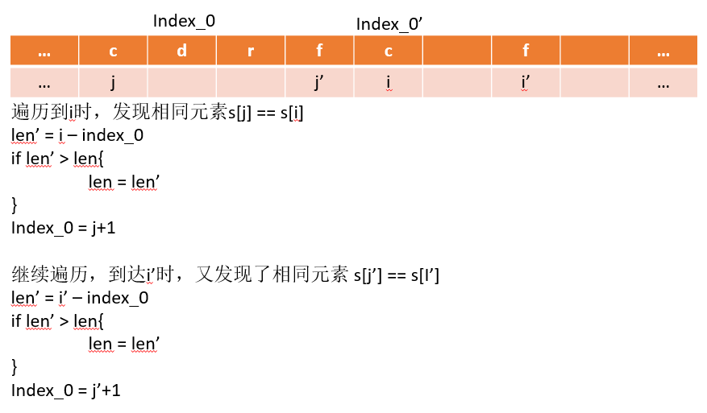

## 3. Find the longest substring without repeating characters


Given a string, find the length of the longest substring without repeating characters.

给一个字符串，求出最长的无重复字符的子字符串长度。

Examples:
    Given "abcabcbb", the answer is "abc", which the length is 3.

    Given "bbbbb", the answer is "b", with the length of 1.
    
    Given "pwwkew", the answer is "wke", with the length of 3. Note that the answer must be a substring, "pwke" is a subsequence and not a substring.


思路：

遍历字符串，每个字符串都在map中查找是否有相同的字符，如果存在相同元素s[j]，则计算（i-j）来计算长度;新的index_0即为j+1;然后在map中删除该元素，以确认下一次遇到相同元素是s[i]而不是s[j]。

map是一个（字符-index）的键值对 map[rune]int.




```go

func lengthOfLongestSubstring(s string) int {
	/*
	 * ret：最终结果
	 * index_0: 当前字符串的起始位置
	 */
	var ret, index_0 int
	m := make(map[rune]int)

	for i, v := range s {
		j, ok := m[v]
		if ok && (j >= index_0) {
			// 存在重复字符
			if (i - index_0) > ret {
				ret = i - index_0
			}
			index_0 = j + 1
			delete(m, v)
		}

		m[v] = i
	}

	if len(s)-index_0 > ret {
		ret = len(s) - index_0
	}

	return ret
}

```