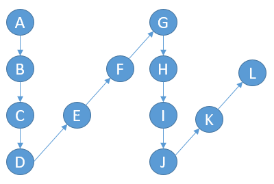

## 6. Zigzag convertion

对输入的字符串做锯齿形变换，并输出新的字符串，所谓zigzag变化如下图所示。



将"ABCDEFGHIJKL"做4行的锯齿变换，新的字符串为：AGBFHLCEIKDJ"

实现一个根据输入字符串s与行数numRows的函数。

思路：

根据输入的行数创建一个字符串slice， slice一个元素表示该行的所有字符，最后将所有slice元素相加，即为新的字符串。

```go 

func zigzag_convert(s string, numRows int) string {
	if numRows == 1 {
		return s
	}
	var str string
	tmp := make([]string, numRows)
	for i, c := range s {
		j := i % (numRows*2 - 2)
		if j < numRows {
			tmp[j] += string(c)
		} else {
			tmp[numRows*2-2-j] += string(c)
		}
	}

	for _, str1 := range tmp {
		str += str1
	}
	return str
}
```

