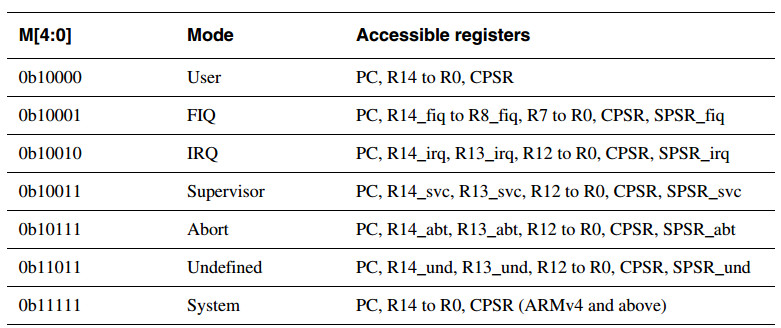

## ARM架构中的程序执行与调用

### 1. 几个名词
- ABI ：
1. 可执行文件必须遵守的规范，以在特定执行环境中运行；
2. 单独产生的可重定址的文件必须遵守的规范，以用来链接和执行。

- EABI: 
适用于嵌入式环境的ABI

- PCS：
程序调用规范（Procedure Call Standard）

- AAPCS：
PCS for ARM Architecture
AAPCS定义了单独编译、单独汇编的程序是如何一起工作的。

- Routine、subroutine 
控制可以进入的一段程序，调用之后，可以将控制返回给它的调用者。这里可分别理解为程序调用者、被调用者

- Procedure: 
A routine returns no result value.

- Function；
A routine returns a result value.

- Active stack、call-frame stack:
调用者栈帧


### 2. 数据类型

#### 2.1 基础数据类型

- 整型
unsigned byte(8), signed byte(8), unsigned half-word(16), signed half-word(16), unsigned word(32), signed word(32), unsigned double-word(64), signed double-word(64)

- 浮点型
half precision(2), single precision(4), double precision(8)

- 容器向量
64-bit vector(8)，128-bit vector(16)

- 指针
数据指针(4)，指令指针(4)

#### 字节序

从软件视角看，内存是字节的阵列，每一个字节都是可寻址的。

- 小端字节序
数据在内存中，数据的最低字节放在内存中最低地址上。

- 大端字节序
数据在内存中，数据的最低字节放在内存中的最高地址上。

#### 复合类型

- an aggregate, 类似于C中的结构体, where the members are laid out sequentially in memmory

- a union, 枚举类型内的元素有相同的地址

- 数组， 相同类型数据的集合，连续地址存储

#### 2.2 数据对齐

- 数据自身对齐
比如，byte对齐为**1**个字节，word对齐为**4**个字节。如果数据的对齐值为N，则该数据的存放地址位于N的整数倍的位置，即“数据地址 % N == 0”。

- 结构体对齐值
结构体成员中最大的对齐值即为结构体对齐值。同样，该结构体存放的地址为对齐值N的整数倍。

- 在C中可以使用 #pragma pack(N) 来指定对齐值

下面以C语言为例，看一下结构体的对齐方式：

```
#include <stdio.h>
#include <stdlib.h>

typedef struct s{	
	int a;
	char b;
	long long c;
	short d
} s;

s t;

int main(void)
{
	char *c;
	t.a = 1;
	t.b = 1;
	t.c = 1;
	t.d = 1;
	
	printf("size of t is %d\n", sizeof(t));
	
	for(c = (char*)&t + sizeof(t) -1; c>=(char*)&t; c--)
	{
		printf("0x%x: |--%x--|\n",c,*c);
	}
	
	return 0;
}

```
程序输出如下：
```
size of t is 24
0x40ea3f: |--0--|
0x40ea3e: |--0--|
0x40ea3d: |--0--|
0x40ea3c: |--0--|
0x40ea3b: |--0--|
0x40ea3a: |--0--|
0x40ea39: |--0--|
0x40ea38: |--1--|
0x40ea37: |--0--|
0x40ea36: |--0--|
0x40ea35: |--0--|
0x40ea34: |--0--|
0x40ea33: |--0--|
0x40ea32: |--0--|
0x40ea31: |--0--|
0x40ea30: |--1--|
0x40ea2f: |--0--|
0x40ea2e: |--0--|
0x40ea2d: |--0--|
0x40ea2c: |--1--|
0x40ea2b: |--0--|
0x40ea2a: |--0--|
0x40ea29: |--0--|
0x40ea28: |--1--|
```


可以看出这是小端字节序，即数据的最低字节存放在最低地址。b的存放位置位于0x40ea2c地址处，虽然只占一个字节。但是由于成员c是8字节对齐的，c的起始地址8位对齐，所以c应该位于0x40ea30，0x40ea2d到0x40ea2f这三个字节是为了对齐而扩充的。而该结构体的对齐值为成员的最大对齐值也为8，所以最后一个成员d，虽然只占2字节，但是需要扩充的8字节对齐。

### 3. 程序调用

ARM架构定义了一组核心指令集和一些有协处理实现的附加指令。核心指令集可以访问核心寄存器，协处理器合一提供附加的寄存器用于某些特殊操作。


#### 3.1 ARM寄存器

ARMv7架构中包含了16个32位寄存器，可以用R0-R15表示。下表中描述了每个寄存器的特定应用。

|  寄存器        |  特殊名称      |  用途  |
| --- | ---- | -- |
|  R15      |  PC |  程序计数器 Program Counter  |
|  R14      |  LR |  链接寄存器 Link Register  |
|  R13      |  SP |  栈指针 Stack Pointer  |
|  R12      |  IP |  The Intra-Procedure-call scratch register  |
|  R11      |   |  变量寄存器8 Variable-register 8  |
|  R10      |   |  变量寄存器7 Variable-register 7  |
|  R9      |  v6 SB TR |  平台寄存器，其功能是由平台定义的  |
|  R8      |   |  变量寄存器5 Variable-register 5  |
|  R7      |   |  变量寄存器4 Variable-register 4  |
|  R6      |   |  变量寄存器3 Variable-register 3  |
|  R5      |   |  变量寄存器2 Variable-register 2  |
|  R4      |   |  变量寄存器1 Variable-register 1  |
|  R3      |   |  参数寄存器4 Argument, scratch register 4  |
|  R2      |   |  参数寄存器3 Argument , scratch register 3  |
|  R1      |   |  参数、结果寄存器2 Argument, result, scratch register 2  |
|  R0      |   |  参数、结果寄存器1 Argument, result, scratch register 1   |

r0-r3四个寄存器用来向被调用程序传递参数，以及从一个函数返回结果。ARMv7中用寄存器传递参数最多可以有四个，更多的参数传递，则需要用到栈来实现。这几个寄存器也可以当做普通寄存器来存储临时值。

寄存器r12(IP)被链接器使用，在调用程序和子程序之间作为一个scratch register 。

r9寄存器功能是对应平台定义的，一个虚拟平台可以任意使用该寄存器，但要给出说明。比如，它可以作为一个静态基地址（static base, SB）在一个位置无关数据中； 或者也可以作为线程寄存器（thread register， TR）。

一个被调用程序必须保存寄存器r4-r8,r10,r11的值，因为这些值可能保存着调用程序的某些局部变量。被调用程序还必须保存SP寄存器，以在返回时恢复调用前的栈信息。

在所有的程序调用标准中，寄存器 r12-r15都有着特殊的角色，用IP、SP、IR、PC来表示。

寄存器CPSR（当前程序状态寄存器）包含以下特性：

- The N, Z, C, V and Q bits (bits 27-31) and the GE[3:0] bits (bits 16-19) are undefined on entry to or return from a public interface. The Q and GE[3:0] bits may only be modified when executing on a processor where these features are present。

- On ARM Architecture 6, the E bit (bit 8) can be used in applications executing in little-endian mode, or in bigendian-8 mode to temporarily change the endianness of data accesses to memory. An application must have a designated endianness and at entry to and return from any public interface the setting of the E bit must match the designated endianness of the application

- The T bit (bit 5) and the J bit (bit 24) are the execution state bits. Only instructions designated for modifying these bits may change them

- The A, I, F and M[4:0] bits (bits 0-7) are the privileged bits and may only be modified by applications designed to operate explicitly in a privileged mode.

- All other bits are reserved and must not be modified. It is not defined whether the bits read as zero or one, or whether they are preserved across a public interface.


| 位 | 作用 |
| - | --|
| N | 负标志位，当运算结果为负时，该位被置1 |
| Z | 零标志位，当运算结果为零时，该位被置1 |
| C | 进位and借位标志，当运算结果为负时，该位被置1 |
| V | 溢出标志，有符号溢出时，该位被置1 |
| Q | 溢出饱和标志，在一些DSP指令中，该位指示是否发生溢出或者饱和 |
| GE[3：0] | 大于等于标志 |
| E | 装载、存储字节序 |
| A | disable data aborts when it is set |
| I | disable IRQ when it is set |
| F | disable FIQ when it is set |
| M[4：0] | 处理器运行模式 |


处理器的运行模式如下所示：



#### 3.2 ARM中程序的栈、内存

AAPCS 应用于单线程执行，程序状态保存在机器寄存器及该程序可访问的内存里面。一个进程可访问的内存是可以在执行中变化的。

程序的内存可以分为以下五个部分：

- Code 代码段，只读，存放指令代码
- Read-only static data, 只读的静态数据区
- Writable static data, 可写的静态数据区
- the heap, 堆
- the stack， 栈

其中，可写的静态数据区可以进一步分为初始化的、零初始化、未初始化的数据区。除了栈，其他部分不必占用连续的内存地址。一个程序必须有栈和代码区，其他部分不是必须的。

堆是一段由进程自己管理的内存区域，比如在C中通过malloc分配的空间就在堆上。堆常用于动态创建数据对象。

程序只能执行位于代码段的指令。

##### 3.2.1 栈

栈用来保存局部变量和传递参数，当参数寄存器不够用时就是通过栈来传递参数的。

栈被设计为向下增长的，即栈顶在最低地址，栈顶的位置保存在寄存器SP中。一般情况下，栈有一个基地址base和一个栈大小限制limit。栈可以用固定的大小，或者是动态变化的（通过调整limit来实现）。

栈的一些规则：

- 栈指针在基地址与栈限制之间， stack_limit < SP <= stack_base
- SP mod 4 = 0, 栈地址保持4字节对齐
- 程序只能访问闭区间[SP, stack_base-1]的栈内存范围

#### 3.3 子程序调用

ARM指令集中的**BL**指令表示带链接寄存器的跳转，当执行 **BL** 指令时，会把PC中下一条指令地址存到LR寄存器中，然后将跳转的目的地址存到PC中。跳转到r4中地址的代码可以用如下的指令实现，其效果等效于 BL r4。

```
MOV LR, PC
BX r4
```

#### 3.4 结果返回

返回的方式取决于返回结果的类型：

- 半精度浮点类型占2个字节，返回在r0的低16位
- 小于四个字节的数据类型返回到r0中，但是做了0扩展或是符号扩展
- 四个字节的数据类型，直接返回到r0中
- 双字的类型返回到r0和r1中
- 128位的类型返回到 r0~r3中
- 小于等于四个字节的复合类型返回到r0中。
- 大于四个字节的复合类型，存在内存中，内存的地址是通过参数传进子函数的。

#### 3.5 参数传递

程序调用通过寄出去你r0-r3和栈来传递参数，参数较少时便用不到栈。

参数传递被定义为两层概念模型：

- 一种从源码语言参数到机器类型的映射 A mapping from a source language argument onto a machine type
- 整理机器类型来产生最终的参数列表 The marshalling of machine types to produce the final parameter list


