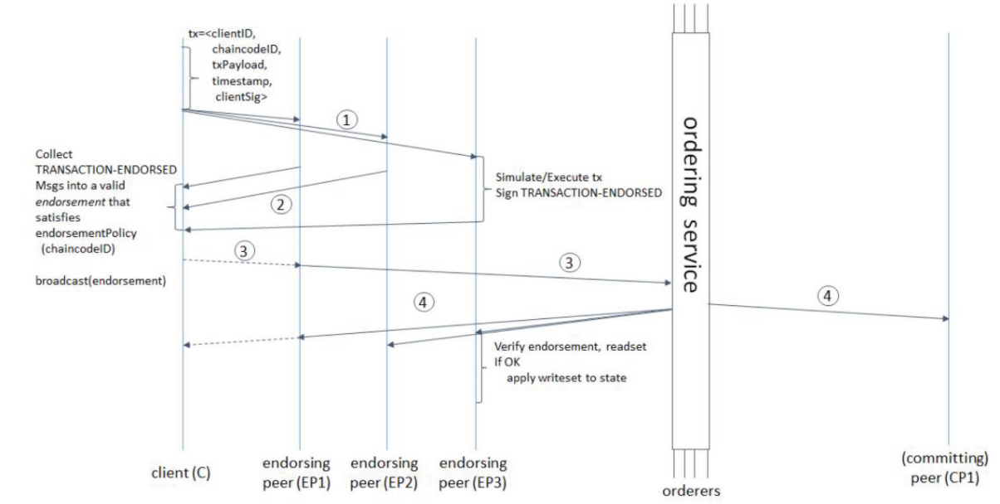
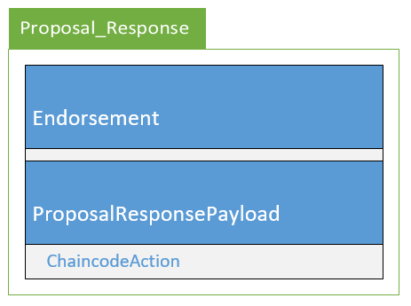
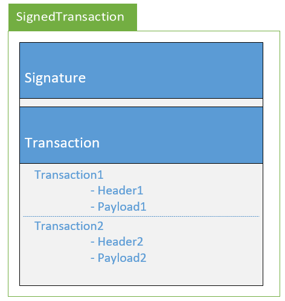

## Hyperledger Fabic中的Transaction流程

Transaction处理流程时从client发起proposal到背书节点，背书节点发返回背书结果。client再将proposal及其返回打包成成transaction，并将transaction发送到ordering-service排序并打包成block，广播到commit-peer。最后commit-peer验证交易并更新账本。

### 1. Endorsement

该过程由Client向endorse-peer（背书节点）发出proposal消息，背书节点会验证该消息，并模拟执行。需要注意，此时模拟执行的结果并不会写入ledger中。之后，背书节点会向Client发送对应该proposal的response。

Proposal的消息结构如下所示，其中包含一个Header（identifer、metadata、ID of chain等）、Payload。

endorse-peer会验证proposal的如下内容：

+ proposal格式
+ 该proposal是否之前收到过，防止replay-attack.
+ 用MSP检查签名是否正确
+ 提交者是否符合当前channel的权限要求

proposal_response的消息如下，其中包含是否成功的code、payload、signature等。payload中会包含proposal的hash值，以便将response与特定的proposal对应。

### 2. Ordering

client收到proposal的response之后，会将这些通过endorse的proposal及其response组成一个transaction。什么条件表示endorse通过是由背书策略决定的。

然后，client将transaction发送给Ordering-Service，经过ordering-service的排序后，order-peer会将排序后的transaction打包成block，然后将这些block广播到所有commit-peer（记账节点）。

### 3. validate

commit-peer收到block后会验证其中的transaction，当验证通过后，会将根据block信息更改ledger，并产生一个propriate event事件。

