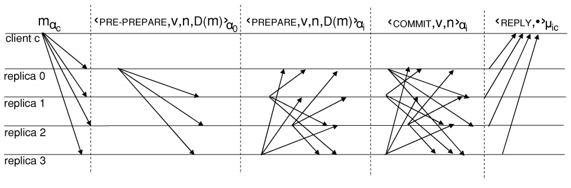

## PBFT_拜占庭容错算法

根据论文《Practical Byzantine Fault Tolerance and Proactive Recovery》整理

**Practical byzantine fault tolerance and proactive recovery** M.Castro and B.Liskov. 2002. 

+ 容错$f$个节点需要$3f+1$个总节点。
___

本算法是基于状态机复制模型的，服务被抽象称为一个状态机，分布式系统的各个节点复制相同的状态，当存在少数节点故障时，状态机依然可以正常运转。

在状态机复制模型中，分布式系统的每个节点都复制完全相同的状态，并支持相同的操作。对于一组相同顺序的输入操作，每个节点都产生相同顺序的输出结果。

BFT算法保证了正常节点在相同的输入下产生相同的输出状态。分布式节点都有一个相同的起始状态，而且每个节点多余相同的输入会产生相同的输入结果。所以，只要保证在分布式系统运行时输入操作的顺序都是一致的，那么各个节点的状态会在运行时始终保持一致。也就是说，对于状态机模型的分布式系统，对输入请求操作的排序是共识算法的关键。

本算法采用“Primary-backup”和"Quorum replication"技术结合，来实现任务排序。虽然Paxos和Viewstamped Replication也采用了相同的排序机制，但是本算法可以实现拜占庭容错。

在“Primary-backup”机制中，各节点都是view的继承表示。在一个View中，其中一个节点作为主节点（Primary）存在，其他节点作为backup。主节点决定操作请求的顺序。主节点给一个请求操作分配一个序列号，并将该分配广播到所有其他节点（backup）。但是主节点也是可能出现错误的，这时需要其他节点来检查序列号，并通过超时检测来确认主节点是否停止工作。一旦检测到当前主节点失败，就会触发View转换，选择一个新的主节点。

算法保证任务序列号是连续的，不能跳跃。当存在View转换时，可以分配序列号给一些空操作，以保证新的主节点内序列号的连续性。

为了保证系统的容错性能，算法依赖于Quorum机制（大多数原则），Quorum机制有以下两个特性：

+ 任意两个Quorum集合都有至少一个相同正确节点
+ 系统中总是存在一个可访问的无错的Quorum

	Quorum就是一个大多数节点的子集，对于包含四个节点的系统{A, B, C, D}，任意三个节点都构成一个Quorum。
	
Quorum的特性使得它可以作为协议信息的一个可靠存储。节点向Quorum写入信息，同时等待Quorum中节点的验证消息。收到的验证消息可以证明，信息已经被写入成功了。

对于一个节点集合R，我们用整数{0, 1, 2, ... |R|-1}表示每一个节点。简化问题，我们假设|R| = 3f+1，其中f是允许的错误节点个数的最大值。View试图用整数v表示，v也是从小到大的整数。主节点可以用p = v%|R|表示。一般情况下，Quorum是包含至少2f+1个节点的集合。

Client请求一个操作$o$时，会向节点广播一个消息$<Request, o, t, c>\alpha_c$。其中，$t$表示请求发生的时间。对于$c$的时间戳用来进行全局排序，需要保证后面的请求有更大的时间戳值。

节点收到请求消息并将其添加到自己的log中，请求的执行及排序在后面的章节描述。节点直接向client发送请求的回复，其回应消息为$<Reply, v, t, c, i, r>\mu_{ic}$ , $v$表示当前View的值，$t$是对应请求的时间戳，i表示本节点id，r表示执行的结果。

当client收到了$f+1$个带有相同的$t$和$r$消息时，就接收处理的结果$r$。由于最多存在$f$个节点发生错误，所以$f+1$个节点一致时，就表示该结果的正确的。

如果Client没有收到足够的回应，那么他会重发请求。节点收到请求消息时，如果该消息应景被执行过了，那么就会直接回复该请求，发送一个reply消息。节点需要保存上一次reply的消息，以便后面重发使用。如果主节点没有分配一个有效的序列号，那么就会被足够多的节点认为是一个错误的节点，并触发一次视图转换。

虽然我们假定client是完成当前请求之后，才会触发下一次请求，但是这也很容易扩展到异步的执行请求。

也可以将协议扩展到多个client的情形，给每个client一个秘钥，节点中保存各个client的秘钥。虽然这个方法简单可行，但是当大量client存在时，还是会出现问题。我们做了如下优化，节点值共享存活的client秘钥，而且限制活动的client数量。

client发出请求之后的过程，用三个步骤来实现，分别是Pre-prepare、prepare、commit。

节点的状态包含服务状态、消息log（记录节点收到和发送的消息）、表示节点当前View的整数。

当主节点p收到一个来自client的请求 $m_{\alpha c} = <Request, o, t, c>_{\alpha c}$时，p会给这个消息$m$分配一个序列号$n$。之后，p会向其他节点广播一个Pre-prepare消息，并将该消息记录到消息log中。Pre-Prepare的格式可以是$<Pre-prepare, v, n, D(m)>_{\alpha p}$，其中v表示当前所处的view，D(m)表示消息的哈希值。

与Pre-prepcare阶段一样，其他几个阶段发送的消息中都会包含$n$、$v$值。节点只会接受与该节点当前所处的view一致的v值的消息。n会用一个区间去判断，即节点会接收符合某个区间的n值的消息。

当消息通过验证时，一个back-up节点接收一个Pre-prepare消息。如果该节点接收一个Pre-prepare消息，并且该节点的消息log中有对应的$m$消息，那么该节点进入Prepare阶段，这时节点会广播Prepare消息$<Prepare, v, n, D(m), i>_{\alpha i}$, 其中i表示该节点。该节点将受到的Pre-prepare消息和发出的Prepare消息都加入到消息log中。当一个节点收到Pre-prepare消息和2f个符合n, v, m的prepare消息时，该节点就被prepare验证通过，说明该节点prepare了该请求。

协议保证了不会出现有着相同View和序列号n的不同消息通过prepare验证。这保证了在同一个view中的所有消息，都有确定的全局顺序。
	假设存在两个不同消息$m$、$m'$通过prepare验证，而他们有着相同的v、n值。根据Quorum原则，一个Quorum中至少有一个节点是正确的。这个节点会发送Pre-prepare或者prepare消息，给在同一个view中的m和m'分配相同的序列号。而根据之前的规定，节点分配序列号应该是累加的，对于不同的消息不应该是相同的序列值。
	
对于不同view下带有相同序列号的消息来说，commit阶段解决了全局排序的问题。每个节点都广播$<Commit, v, n, i>_{\alpha_i}$的commit消息，表明该节点已经经过prepare验证，并将该消息加入消息log中。每个节点都会手机commit消息，直到它收到了匹配v和n的2f+1条commit消息，我们叫这个过程为commit验证，验证通过称之为请求被commit了。这个过程之后，节点就同时通过了prepare验证和commit验证。

当请求被commit之后，协议保证请求已经被大多数节点所prepare，也就是说存在一个Quorum知道一个Quorum的节点接受了一个在v视图下的n序列值。这时发生视图转换时，新的主节点可以通过从一个Quorum中读取prepare验证消息，来给新的视图中选择新的序列值n。新的序列值n应该是上一个视图中n的下一个整数。这就可以实现在不同视图下的全局排序了。

当请求被commit之后，节点就会执行消息m对应的操作，节点会根据序列号值从小到大执行操作。所有没有发生错误的节点都会以相同的顺序执行操作。执行完请求操作之后，节点向client发送一个回应信息。为了保证消息只被执行一次，当节点收到比上一次回应的请求消息中的时间戳小的消息时，会忽略。

在这个过程中，没有依赖顺序的消息传送，因此节点commit请求的过程可以是乱序的。

