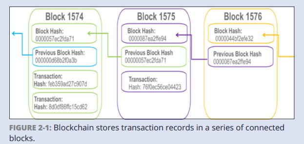
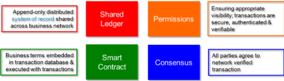

##  Blockchain For Dummies（IBM Limited Edition）笔记

该系列内容主要介绍用于商业的区块链，有人说区块链之于贸易，犹如因特网之于信息。在商业领域区块链可以用于交易任何事物，并在交易中建立互信、提高效率。毫不夸张的说，区块链可以改变世界运作的方式。

如果你曾经买过房子，在买房子过程中你需要签署一大堆文件，需要在银行、政府部门、房产中介等机构之间走完繁琐的流程。

区块链具备简化这些复杂流程的潜力，之所以需要各种复杂流程，是因为处理事务的双方或多方需要建立一个互信的基础，而建立互信需要依赖于某些权威部门的证明。然而区块链技术可以在成员之间建立互信，而不必依赖于第三方。

### 区块链基础

区块链是一个共享的分布式账本，可以在一个商业网络中促进事务记录、追踪资产。这里资产可以是任何有形的、无形的资产，可以是房子、车子等有形资产，也可以是专利、权限等。在一个区块链网络中，任何的虚拟数值都可以被追踪、被交易。

#### 区块链的起源

通过探究区块链的产生背景，可以对区块链有一个更加深入的理解。区块链产生于这样的背景下，人们需要一种高效的、低成本的、可靠的、安全的系统来处理、记录金融相关事务。

##### 当前交易系统的弊端

人类历史中，信用工具的使用极大的促进了价值交换，比如金币、纸币、银行系统等工具可以在交易双发建立相互互信（这种互信依赖于铸币的权威）。许多重要的发明，包括手机、信用卡、网络等，使得交易更加的高效、便捷。

然而，当前的交易方式中存在许多的瓶颈，限制的交易的进行，比如：

+ 现金只适用于局部的、小数额的交易，比如买个煎饼果子。现在买个煎饼果子用支付宝就可以了，也用不到纸币了。
+ 交易到结算的时间可能会很长
+ 重复的工作、第三方或者中介的存在更加较低了交易的效率
+ 欺诈攻击等增加了交易的潜在成本，比如中央银行收到攻击，可能交易的双方都面临风险
+ 信用卡的使用，存在很多隐藏的成本，交易费，审核周期等等问题
+ 很多人没有银行账户，这需要很多其他渠道用于交易。

目前全球交易的体量越来越大，呈现指数型增长，这会导致交易系统更加复杂，漏洞更加明显。电商、物联网等事物的发展，会极大的增大交易体量。

为了应对贸易体量增长所带来的问题，人们需要一个更加高效、便捷、安全的支付网络来提供不依赖于特定机构的、无需交易费用的方式来建立互信。

##### 比特币的诞生

比特币的初衷是用来解决贸易中的诸多问题，是中本聪（化名）提出的一种数字加密货币。不像传统的货币依赖于中央银行，比特币是去中心化的货币，没有一个机构或个人可以控制它。比特币是通过“挖矿”来产生的，比特币的产生依赖于节点的工作量证明。在P2P分布式网络中，每个节点的主机都进行计算来解决某个复杂的问题，计算的过程中的运算次数可作为节点的工作量证明。

比特币存在以下优点：

+ 成本低： 不需要中介
+ 有效： 交易信息记录一次，并且被广播到网内的其他节点上
+ 安全： 分布式的账本作为一种交易证明，每一个交易都不能被改变，只能等被保存和传播，交易对于每个节点都是可见的。

##### 比特币与区块链

比特币是基于区块链技术而产生的，也是区块链技术应用的第一场景。区块链技术作为一个共享的账本记录了交易数据，这个共享账本实际上可以记录任何数据。举个例子，可以用区块链技术记录物流信息，货物从出厂到销售的整个过程都可以被记录，而且被用户可见。

#### 传统交易网络的革命

在传统交易方式中，交易网络的中成员在各自独立的账本中保存交易数据、资产追踪等。由于交易的各方都只认可自己的账本，这就需要第三方中介，来建立交易双方的互信，这会额外增加交易成本。除此之外，还会延缓交易的进度。第三方的如果出现问题，可能导致交易的各方都要承担风向。

在应用区块链的交易网络中，交易的各方共享的相同的交易账本，这时交易数据、资产状况等都是透明的。交易的各方在同一个账本的基础上建立互信，无需第三方参与。由于区块链的数据不能被修改，各个节点天然的具备互信的基础。再使用智能合约，来定制交易时遵循的规则，交易各方都遵循相同的规则，可以极大的简化交易的流程。

一个区块链网络具备如下的几个特性：

+ 共识： 区块链上的每一笔交易都会广播到各个节点，并接受各个节点的校验。
+ 追溯： 每一笔资产都可以从追溯其从产生到当前的每一笔交易过程
+ 不可变： 每一笔交易一旦被确认，就不可更改
+ 最终性：账本提供一个唯一的当前状态的，即区块链末端，资产在区块链末端的状态就是其当前的归属

##### 探索区块链应用

以汽车行业为例描述区块链的应用，汽车从生产到销售存在如下几个角色，制造商、销售商、租车平台、租车人、买车人等。

制造商、各个销售商、各个租车平台可以构建一个区块链网络，每个节点都共享所有的车辆数据账本，其中记录了汽车从生产到当前的所有交易数据。

区块链可以按照如下的方式运作：

1. 政府相关部门负责新车在区块链上的注册、及车辆的交易信息
2. 制造商制造新车，通过只能合约产生车辆编号
3. 销售商可以看到新的库存信息，可以控制汽车的所有者从制造商到购车人
4. 租车平台可以看到销售商的库存，汽车的所有者可以从销售商转移到租车平台
5. 租车人员可以看到租车的库存，并租车。

##### 应用区块链技术的优点

+ 节省时间
由于交易的各方共享同样的数据，交易的时间极大缩短，以前买车可能是用户、供应商、制造商、银行等多方查询信息，现在各方都保存相同的数据，手续简化了，时间减少了。

+ 节省成本
	+ 监督的环节不需要了，因为大家共同维护区块链，任何交易都会被大家验证，不需要专门的监督环节
	+ 中介不需要了
	+ 不需要重复性的工作了

+ 安全性
区块链可以抵御攻击，对于存下权限的区块链网络来说，只有特定节点有权限修改区块链产生新的区块，这样安全级别会更好。

不是所有的区块链都是用于商业的，有的区块链是有权限，有的是无权限的。对于商用的区块链来说，权限的区块链网络更加合适。有权限的区块链网络提供了以下特性：

+ 增强的隐私性，通过用户ID和权限，可以限定用户所能访问的信息
+ 更容易监控，共享的账单作为信用体系的唯一来源，实现了监控授权交易的可能性。
+ 运行效率更高，纯数字资产使得交易中所有权的转移更加快捷

##### 区块链中建立互信

区块链可以增加商业网络中的互信，不是说你能信任你的交易对象，而是说在区块链网络中你不必关心信任问题。

区块链极大地提高了成员之间的信任，这时因为区块链上的每一笔交易都是建立在上一笔交易的基础上的，任何可能发生的腐败都是透明的，每个节点都可以看到。这种自我监督的机制就减少了对政府部门的依赖，不需要第三方来监督交易程序了。

在需要第三方监督的地方，区块链降低了监管系统的负担，使审计师和监管机构更容易审查相关交易细节并核实合规。

区块链基于以下五个特性来建立节点间的互信：

+ 分布式&可扩展，分布式账本是共享的，并且随着每一笔交易的发生更新，有选择的节点间近乎实时地复制。这个账本不是属于某一个特定的节点或组织，不依赖于单一的实体。
+ 安全&隐私&不可更改：通过在区块链中设置权限及加密等方式，确保参与者的特定权限，以此保证安全性。可以通过加密或者是数据库技术对账本的可见性进行设置，以实现隐私保护。在条件达成一致后，参与者不能篡改交易记录，只有在新的事务中才能逆转错误。
+ 透明的&可审计的，区块链网络的参与者共享相同的记录，因此每个参与者都可以校验交易的发生，而不需要第三方的参与。交易事件是基于时间戳的，可以近乎实时地校验交易的有效性。
+ 共识，所有节点都必须统一交易的有效性，这是通过共识算法实现的。每个区块链都可以建立交易建立或资产交换的条件。
+ 灵活性，商业上的规则和智能合约可以加入到平台中，区块链商业网络可以实现端到端的商业流程和广泛的应用。

### 区块链是如何工作的

#### 为什么叫做"区块链"

之所以叫这个名字，是因为它以块的形式记录交易数据，这些块组成一个链的结构。随着交易数量的增加，区块链也不断产生新的区块，区块链越来越长。区块记录和确认交易事件的时间和顺序，这些都会被记录进区块链中，区块链使用分布式网络结构，通过特定的规则来记录区块数据。

每个区块都包含一个哈希值、一批时间标记的交易还有上一个区块的哈希值。之前产生的区块通过哈希值连接在一起，区块之间的连接是不可更改的，不能在已经存在的两个区块间插入新的区块。每产生一个新的区块都会加强之前所有区块的稳定性，这样的机制使得区块链避免被修改。

区块链记录交易数据并不是用来代替数据库技术、通信技术、交易流程等等，区块链是用来验证交易的有效性的。虽然区块链本质上是用于记录事务的数据库，但它的好处远远超出了传统数据库。

#### 如何构建商业化的区块链

比特币这样的区块链网络是任何参与者都公开的，这适用于构建数字货币，但是不适合于商业网络。用于商业网络的区块链应该是有权限的、确保隐私的网络，每个参与者都必须使用分配的ID。

为了更加深入的理解商业化区块链网络如何运作，你需要理解以下四个概念

##### Shared Ledger

共享分布式账本记录所有的交易事务，该账本只可以新增而不可更改已有记录。共享账本中，交易只被记录一次，不必重复记录。

+ 记录区块链网络中的所有事务，共享账本是一个记录系统，是唯一的信任来源；
+ 在所有网络节点中共享，每个节点都有着账本的完整拷贝
+ 具有权限的，网络参与者只能看到对应权限的数据。

##### Permissions

区块链可以是有权限的，也可以是无权限的。比特币是典型的无权限网络，任何的节点都对所有数据可见。在一个有权限的区块链网络中，每个参与者都有一个唯一的ID，实现响应的策略来有限制的访问网络。有了约束网络参与的能力，组织可以更容易地遵守数据保护法规。通过权限控制，在控制被追加到区块链的数据的一致性方面也更有效。

通过限制访问交易数据细节，更多的交易数据可以存放在区块链上，网络构建者可以指定哪些数据对用户可见。

比如说A公司与B公司达成一笔交易，只有A、B两个公司可以看到交易细节，而C公司只看到A、B发生了一笔交易，但是交易细节是看不到的。

##### Consensus

区块链网络中节点的信任是基于共识机制的

+ Proof of Stake(权益证明)，为了验证交易的有效性，验证者必须超过一定的比例。权益证明可以具备一部分抵御异常攻击的能力。
+ Muti-signature: 验证者中的大多数必须同意交易的有效性
+ Practical Byzantine Fault Tolerance（实际拜占庭容错）,用于解决计算节点(网络参与者)之间的纠纷的一种算法，当一个节点在一组节点中生成不同于其他节点的输出时需要用到该算法。

	在商业化的网络中是不需要使用工作量证明的，尽管对于比特币这样的区块链网络工作量证明是必不可少的。工作量证明在公有链中是有用的，工作量证明是基于计算节点算力的，这时一种昂贵的共识机制。在商业化网络中，其参与者都是有权限的已知节点，不需要使用挖矿这样的方式。
	
##### Smart contracts

智能合约是一系列规则，用来规范区块链中交易方式。智能合约存储在区块链中，当交易发生时自动激活。聪明的合同可能有许多形式，可以部分或完全自我执行，自我执行，或者两者兼有。智能合约的目的是提供优于传统合同法的安全保障，同时降低与传统合同相关的成本和延迟。

#### Identitying Participancts and Their Roles

+ Blockchain User， 该角色(通常是业务用户)具有加入区块链网络并与其他网络参与者进行事务的权限。区块链技术在后台运行，所以区块链用户没有意识到。在任何一个业务网络上都有多个用户。
+ Regulator， 具有特殊权限的区块链用户，用于监视网络内发生的事务。监管机构可能被禁止进行交易。
+ Blockchain developer， 开发区块链平台的程序员。
+ Blockchain network operator，具有定义、创建、管理和监视区块链网络的特殊权限和权限的个人。区块链网络上的每个业务都有一个区块链网络运营商
+ Traditional processing platforms，现有的计算机系统，可能被区块链用于增强处理。这个系统可能还需要将请求初始化到区块链中。
+ Traditional data sources，现有的数据系统可以提供数据来影响智能合同的行为，并帮助定义传统应用程序/数据和区块链之间的通信和数据传输方式——通过API调用、thru MQ风格的云消息传递，或者两者都有。
+ Certificate authority，颁发和管理运行区块链所需的不同类型证书的个体。例如，可能需要向区块链用户或单个事务发出证书。

### 区块链对商业的推动作用

在当前的全球贸易中，贸易摩擦五花八门，并且与日俱增。区块链技术可能具备较少贸易摩擦的作用。

#### 各种贸易阻碍

这里的贸易阻碍指的是任何阻碍交易顺利进行的因素，比如信息不对等、关税等等。

#####  信息阻碍

+ 信息不对等，消息的双方不能基于相同的信息进行交易。
+ 信息缺失，由于各种各样的原因，有的消息时无法访问的。
+ 信息风险，信息可能存在的风险，比如黑客可以入侵造成的信息泄露

##### 中介阻碍

当交易数额巨大或者是物理因素无法直接交易的时候，需要第三方参与，这时会造成交易成本上升。

##### 创新停滞

+ 制度惰性:内部官僚主义和遗留系统以及人类对变革的自然抵抗会阻碍公司的反应。
+ 限制性法规:虽然可能需要法规来控制行业行为，但它们有引入成本和延迟的副作用。
+ 无形的威胁:新技术使新的具有竞争力的商业模式成为可能，这是组织无法计划的威胁。对许多人来说，这种不断增长的不确定性将破坏企业的持续成功。小公司和灵活的大公司都将尝试新的方法，虽然很多会失败，但有些会重新定义整个行业。

#### 区块链减少贸易阻碍

##### 信息方面

业务决策所需的信息的不确定性通常是业务的障碍。区块链有几个减少信息摩擦的属性，包括以下属性：

+ 共享的账本，区块链将商业模式从信息被单个个体享有转换为所有节点共享信息。参与者可以验证事务并验证身份和所有权，而不需要第三方中介。所有相关信息都可以根据其角色和访问特权与他人共享。
+ 受限的权限，商业的区块链可以设计为只允许成员的加入的模式，这样每个成员都是已知的，通过唯一的ID限制其访问权限。参与者可以进行交易，确信与他们打交道的人就是她声称的那个人。
+ 加密手段，通过在区块链网络上引入合理的加密手段可以很好的保护用户的隐私。
+ 共识机制

##### 中介阻碍

区块链具备天然的去中介性质

+ 共享的账本可以使得资产的所有权可以追溯并确认，无需第三方却确认对方资产
+ 基于状态的通讯，如今银行通过安全消息架构(如SWIFT)进行通信，以完成任务，每个银行都在本地维护其任务状态。通过区块链，银行可以发送表示区块链上任务的共享状态的消息，每个消息将任务移动到生命周期中的下一个状态。
+ P2P分布式交易，区块链中各个节点之间可以直接相互转移资产
+ 共识机制，通过共识机制来确保交易的有效性，不需要第三方来验证
+ 智能合约

##### 创新阻碍

+ 较低复杂性成本，随着组织发展越来越大，其事务处理流程更加复杂。区块链可以降低这种复杂性，重新定义组织
+ 较低延迟和成本，自动化不能通过监管完全消除治理，但它可以降低成本并减少监管过程固有的延迟。
+ 扩大机会:区块链通过提供技术使企业能够开发新的竞争性商业模式，对企业来说既有利也有弊。一些企业将会倒闭，而另一些将重新定义整个行业。

### 区块链使用场景

#### 金融服务

##### 商业融资

