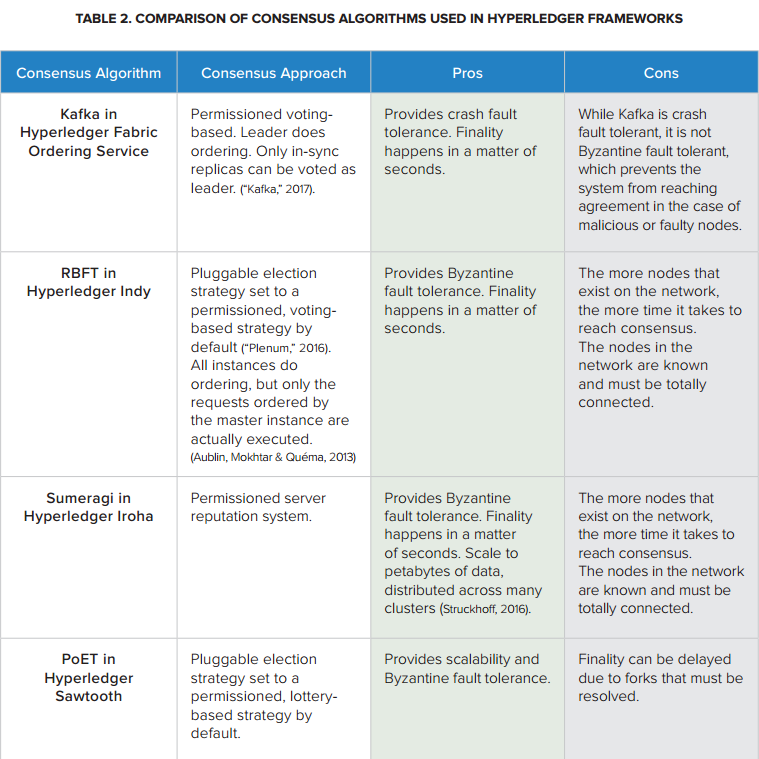
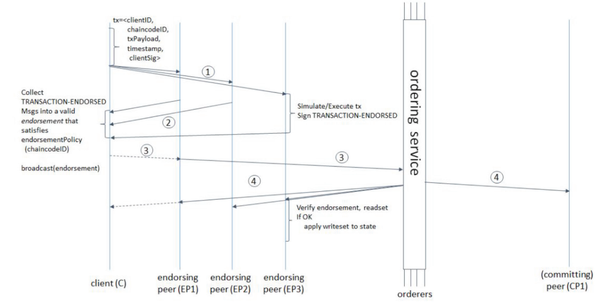
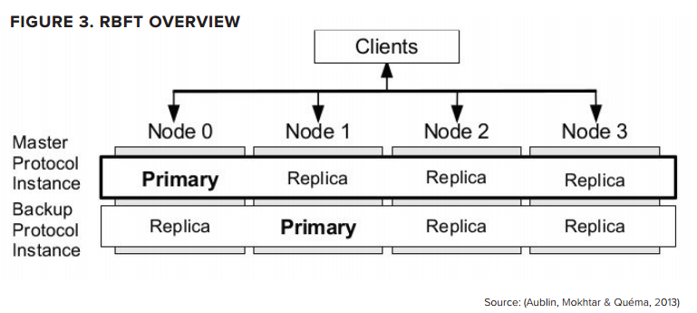
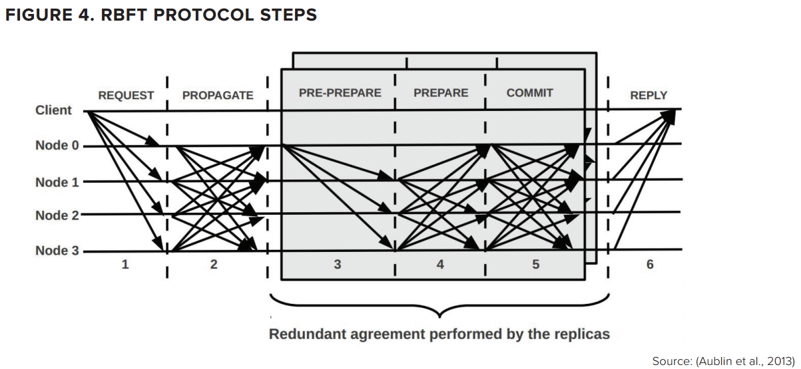
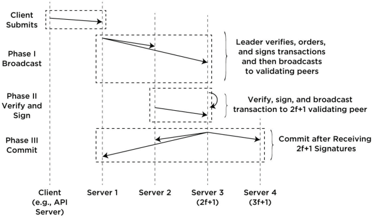
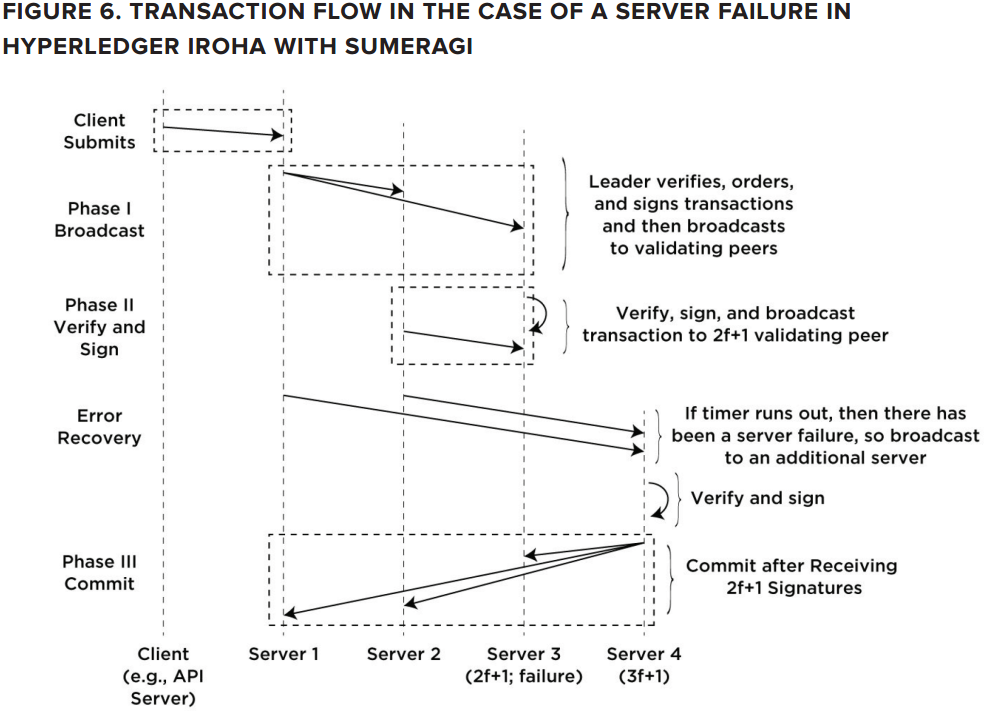

## Hyperledger Consensus

### 共识过程

Hyperlydger中建立共识的过程由以下两个独立的过程构成：

+ Ordering of transactions (交易排序)
+ Validating Transactions（交易验证）

逻辑上将这个两个过程分离可以保证Hyperledger快讲可以应用任何的共识模块。

建立共识的第一步是从client端接收交易，然后由Ordering Service进行交易排序。Ordering Service 可以用多种方法实现，在开发测试阶段可以用中心化的排序服务，也可以面向不同的网络采用分布式协议。

为了实现交易的私密，排序层不应看到交易的具体内容（对交易内容不可见），交易的内容可以采用加密或者是哈希处理。

交易通过接口被传递到排序服务，然后排序服务根据共识算法和配置策略将交易排序。为了提高效率，排序服务会将多个交易打包成一个块再输出，排序服务中需要保证块内交易的顺序。

为了校验交易的正确性，共识的建立依赖于智能合约层，智能合约层定义了商业逻辑来确认如何验证交易有效。智能合约层根据特定的策略与约定来确认每一笔交易都是有效的。无效的交易会被拒绝，并在块中剔除。

潜在的校验失败主要分为以下两种：语法错误、逻辑错误。

语法错误包含以下几种类型，比如无效输入、未验证的签名、重复的交易等，这类交易应该被丢弃。

第二类错误比较复杂，需要有特定策略来觉得如何处理。比如，一笔交易经验证是多重支付。我们需要记录这类交易已验证是否是策略所需要的。

共识层通过通讯层来实现与client或者是其他节点的消息互通。

### 共识属性

共识必须遵循以下两个属性：安全性（Safety）和活跃性（Liveness）。

+ 安全性，是指要保证每个节点都有相同的输入序列，并在每个节点上产生相同的输出。当节点收到一组交易时，每个节点上的状态变化都应该是相同的。算法需要实现在一个节点上，交易以原子方式进行处理，即每次只能处理一个交易。
+ 活跃性，网络中的每个节点都必须接收到每一条提交的交易，除非节点出现错误。

###  Hyperledger Frameworks 中的共识

因为商业区块链的需求是多样的，因此需要不同的共识机制。Hyperledger工作于多种不同的共识机制上，并且是模块化的。

上面表格比较了Hyperledger中用到的共识算法。

###  Hyperledger Fabric 中的共识

Fabric中的共识达成过程分解为以下三个步骤：

+ Endorsement，网络参与式endorse一个交易
+ Ordering，接收经过endorse的交易，将其排序，并打包成block
+ Validation, 接收经过排序的block，验证其中交易结果的正确性，包括检查endorsement策略、二次支付等问题。

Fabric建立共识的三个阶段都支持可配置，用户可以实现自己的endorsement、ordering、validation过程。除此之外，Ordering Service还支持配置基于拜占庭容错的共识算法。Ordering Service API包括两个基本动作：广播、传输。

+ 广播：client端调用该接口实现任意消息的广播，当向一个service发送请求时，在BFT部分也被称为request。
+ deliver：Ordering Service调用该接口用来发送带有特定消息序列值和prehash值得消息。或者说，这是一个从排序服务中用到的输出事件。deliver()在广播-订阅系统中，有时也被称为notify()，在BFT系统中称之为commit()。

多个排序组件正处于开发之中，这包括BFT Smart、Simplified Byzantine Fault Tolerance（SBFT）、Honey Badger of BFT 等等。在Fabric v1中，Apache Kafka作为一个包外参考实现被提供。用户根据使用场景及容错模型来决定使用哪个组件。

### Hyperledger Indy 中的共识

Hyperledger Indy 中的共识是基于Redundant Byzantine Fault Tolerance (RBFT)的，RBFT是由 Plenum Byzantine Fault Tolerance (Plenum)发展来的，可以把RBFT想象成是几个Plenum实例的并行实现。

由一个单一实体发向master的经过排序的请求消息被用来更新ledger，但是master的性能（吞吐量、延迟等）会周期性的与其他实体的平均值进行比较。如果发现master性能低下，则会发生视图更改，将不同的实例分配给master的角色。

与PBFT一样，RBFT至少需要$3f+1$个节点来处理$f$个错误节点。下图展示了一个4个节点的网络，该网络可以处理1个错误节点。其中每个节点都可以运行一个primary(leader)实例。

图4中展现了一个RBFT结构视图，在网络中client向节点发送请求。没有必要向所有的节点发送消息，因为发送$f+1$个就足够了。节点收到client的请求后，会将消息传播，从而使得其他节点都知道请求消息。每个primary节点在收到请求后，都会创建一个proposal（PRE-PREPARE），然后将其发送到其他所有节点。如果其他节点收到主节点的PRE-PREPARE，会返回一个PREPARE消息。一旦节点收到PRE-PREPARE消息以及$2f$个PREPARE消息，那么该节点就有足够的信息来接收proposal并发送commit消息。一旦一个节点收到$2f+1$个commit消息，那么这批请求可以被排序确认并加入到账本中。

Hyperledger Indy 使用RNFT来同处理ordering和validation，从而实现一个简单账本同时实现排序和验证。这一点与很多其他区块链网络有所不同，很多只是使用BFT协议来ordering。这些网络将验证留到请求被排序之后进行。

RBFT中用状态来描述账本，所有有效的、被接收的请求都可能改变账本状态。账本状态是保存在数据库中的变量及其值的组合。状态以Merkle Patricia树的结构被加密保存在数据库中（Merkle Patricia树在以太坊中实现）。Hyperledger Indy将Decentralized Identifers (DIDs) 作为状态来存储，其中状态包括验证秘钥及其他东西。内存中账本交易的复制及状态的改变是在proposal过程中更新的，主节点在发出proposal后就更新状态，而非主节点是在收到确认proposal时才更新状态。当proposal获得排序验证，账本的状态改变就会被确认。如果由于某种原因，proposal失败了，那么尤其发生的状态改变将会恢复。

### Hyperledger Iroha 中的共识

Hyperledger Iroha中引入了称为Sumeragi的BFT算法，该方法可以容错$f$个错误节点，在下面论文中提出。

[BChain: Byzantine Replication with High Throughput and Embedded Reconfiguration](https://link.springer.com/chapter/10.1007%2F978-3-319-14472-6_7)

在B-Chain中，我们在验证交易时考虑全局顺序的概念，并且把节点分为A、B两组，其中A包含$2f+1$个节点，B组包含剩余的节点。在正常情况下，确认一个交易只需要$2f+1$个节点签名就可以了，因此这是我们在交易确认中只使用$2f+1$个节点。只有当确认出现错误时，才会用到剩余的节点，第$2f+1$个节点称为代理尾部。正常情况下的交易验证过程如下图所示：

Client端首先会向主导节点提交交易，这个主导节点会验证交易并将其放到队列中，并且对交易签名。之后，该节点将交易光波导其他$2f+1$个验证节点。

处理节点的顺序是由称之为hijiri的服务器信誉系统来决定的，Hijiri基于以下三个因素来计算服务器的可靠性。

+ 每个server在成员管理系统中注册的时间
+ 成功处理交易的次数
+ 是否发生过错误

为了检测错误，每个server在签署并向代理尾部节点（第2f+1个节点）广播一个交易时会设置一个定时器。如果在定时器时间内没有收到回复或者是发生了错误，那么该server会继续下尾部节点的下一个节点广播该交易。这个过程如下图所示。

当一个验证节点收到和交易时，会做如下几步操作：

+ 1. 验证签名有效
+ 2. 验证交易内容有效
+ 3. 临时性将交易加入到账本，这包括更新全局状态的merkel root
+ 4. 签署更新的Merkel root 以及交易内容的hash
+ 5. 广播
+ 6. 当节点间同步时，Merkel树的有效部分会在root符合的情况下共享。

### Hyperledger Sawtooth中的共识

Hyperledger Sawtooth 推动同时使用lottery-based和voting-based算法的共识机制。默认情况下，Sawtooth使用一个lottery-based算法，称为PoET。为了实现更为有效的分布式共识，一个好的lottery-based算法需要具备以下特点：

+ 公平性，各个节点应该基于公平的相同的概率参与投票
+ 投入，选举的结果应该从潜在的投入值来获得
+ 有效性，应该有一个建档的方式是所有的节点都可以验证结果有效性

当前的Hyperledger Sawtooth实现中，构建了一个TEE（Trusted Execution Environment ）系统，这保证了选举过程的安全性及随机性，而不用电力耗费或者是特殊硬件来加速工作量证明算法。

Every PoET validator requests a random time to wait from a trusted function before claiming leadership. The validator with the shortest wait time for a particular transaction block is implicitly elected the leader. The function “CreateTimer” creates a timer for a transaction block that is guaranteed to have been created by the TEE. The “CheckTimer” function verifes that the timer was created by the TEE and, if it has expired, creates an attestation that can be used to verify that validator did, in fact, wait the allotted time before claiming the leadership role.

The PoET leader election algorithm meets the criteria for a good lottery algorithm. It randomly distributes leadership election across the entire population of validators with a distribution that is similar to what is provided by other lottery algorithms. The probability of election is proportional to the resources contributed, where resources are general purpose processors with a TEE. An attestation of execution provides information for verifying that the certifcate was created within the TEE and that the validator waited the allotted time. Further, the low cost of participation increases the likelihood that the population of validators will be large, increasing the robustness of the consensus algorithm.

