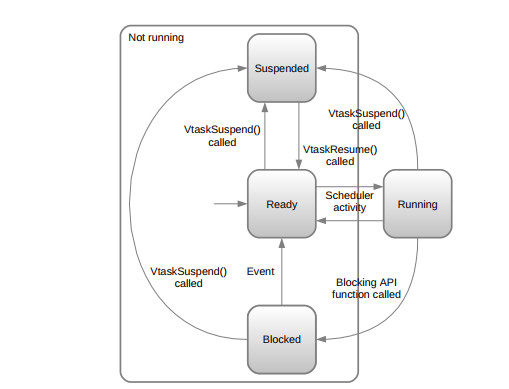

## FreeRTOS简介

### freertos是个啥？

FreeRTOS是一个由 Real Time Engineers Ltd开发的免费开源的实时操作系统，它适用于小型的嵌入式系统中。这个开源系统实现了最简单的工具集，包括：基本的任务处理、内存管理、同步API等；但是没有提供没有提供网络通信、文件系统、外设驱动等部分。

- 支持抢占任务
- 支持23款未处理架构
- 可以同时运行不限数量的任务，只要硬件可以支持
- 实现了队列、二叉树、信号量、互斥量等概念

### task

FreeRTOS允许不限数量的任务同时运行，只要硬件可以处理的过来。作为实时操作系统，FreeRTOS可以处理循环、非循环的任务。在实时操作系统中，任务通过简单的C语言定义，接收void*参数，返回void。

一些任务相关的函数：

- 创建任务：vTaskCreate()
- 任务销毁：vTaskDelete()
- 优先级管理： uvTaskPriorityGet(),uvTaskPrioritySet()
- 延迟/唤醒： vTaskDelay(), vTaskDelayUntil(), vTaskSuspend(), vTaskResume(), vTaskResumeFromISR()

#### task的生命周期

本部分的讨论限于单个微控制器的情况，也就是说任意时刻，只有一个任务运行。任务只有两个状态：“正在运行”、“非运行”。因此在任意时刻，只有一个任务时处于运行状态的，其他的任务则都处于非运行状态。



有多个原因可以导致任务处于非运行状态，一个任务的运行状态可以用图1表示。一个任务可以被更高优先级的任务抢占（图1中的scheduling），从而延迟或者等待。当一个任务可以运行，但是此时处理器正被占用且不能抢占，那么此状态称之为“ready”，这会发生在如下的情况下，任务已经准备好执行，但是这时却有一个更高优先级的任务正在运行。当一个任务被延迟或者等待另一个任务时，该状态被称为"blocked"。可用用vTaskSuspend()、vTaskResume()以及vTaskResumeFromISR()来主动进入或离开“非运行状态”。

需要注意的是，一个任务可以通过vTaskSuspend()等函数进入“非运行”状态，但是只有调度器才可以重新唤醒该任务。当任务准备运行时，它进入“ready”状态，只有调度器可以选择是否将其运行。

#### 创建删除task

任务处理函数可以被简单的C语言定义，如下所示。一般是将任务处理代码放在一个无限循环中，然后再处理函数结束前调用 vTaskDelete() 函数来销毁任务。

```
/* task1处理函数声明 */
void TaskFunction1(void *pvParameters);


/* task1处理函数定义 */
void TaskFunction1( void *pvParameters )
{
	/* Variables can be declared just as per a normal function. Each instance of a task created using this function will have its own copy of the iVariableExample variable. This would not be true if the variable was declared static – in which case only one copy of the variable would exist and this copy would be shared by each created instance of the task. */
	
	int iVariableExample = 0;
	/* A task will normally be implemented as in infinite loop. */
	for( ;; )
	{
	/* The code to implement the task functionality will go here. */
	}
	/* Should the task implementation ever break out of the above loop then the task must be deleted before reaching the end of this function. The NULL parameter passed to the vTaskDelete() function indicates that the task to be deleted is the calling (this) task. */
	vTaskDelete( NULL );
}

```

一个任务可以用 vTaskCreate()函数创建，需要传递给该函数的参数如下所示：

- pvTaskCode；任务实现位置处的函数指针a pointer to the function where the task is implemented
- pcName：任务名字
- usStackDepth：该任务所用的栈长度（单位：字）
- pvParameters：传递给task的参数指针
- uxPriority：任务优先级
- pxCreatedTask：指向任务处理identifer的指针。a pointer to an identifier that allows to handle the task. If the task does not have to be
handled in the future, this can be leaved NULL

```
portBASE_TYPE xTaskCreate( pdTASK_CODE pvTaskCode,
							const signed portCHAR * const pcName,
							unsigned portSHORT usStackDepth,
							void *pvParameters,
							unsigned portBASE_TYPE uxPriority,
							xTaskHandle *pxCreatedTask
						);
```

任务可以被函数xTaskDestroy()销毁，该函数接受一个参数pxCreatedTask，参数表明任务创建的时间。

任务删除时，意味着空闲任务释放掉所有分配的内存，注意所有动态分别的内存必须被手动free掉。

```
void vTaskDelete( xTaskHandle pxTask );
```

### 任务调度

任务调度的目的是觉得哪一个处于“ready”状态的任务进入运行状态，调度是通过优先级实现的。在任务创建时，会给任务一个优先级。优先级是调度器进行任务调度的唯一考虑因素。每一个时钟周期，调度器都会判断唤醒哪一个任务。

#### 任务优先级

FreeRTOS实现了任务优先级来处理多任务调度，优先级用一个整数来表示，在任务创建时确定，可以通过vTaskPriorityGet() 、 vTaskPrioritySet()来更改。优先级数值越低表示优先级越小，0表示最小优先级（保留给idle task），MAX_PRIORITIES-1表示最大优先级。当一个更大的数作为优先级给出时，系统会将其设定为 MAX_PRIORITIES-1。图2中给出了不同优先级运行的例子，task1和task3是基于事件的task，task2是周期性的任务，idle task用来保证始终都有一个任务运行。


#### 同优先级任务的执行

相同优先级的任务是被同等对待的，如果有两个相同优先级的任务处于“ready”状态，那么调度器给这两个任务分配相同的运行时间，以时钟周期为单位轮流执行者两个任务，如图3所示。


#### 任务饥饿

FreeRTOS没有避免任务饥饿的机制，因此需要程序开发者来保证没有高优先级任务占用所有处理器时间。使用idle task是一个比较好的方式，使用它来处理一些重要的工作比如释放内存或者设备进入睡眠模式等。


### 队列管理

队列是FreeRTOS中任务间通信、同步所依赖的潜在机制，由于我们不可避免的需要实现多任务协作，因此理解队列管理机制是十分重要的。

队列被用来存储一个或多个相同数据类型的数据，可以被多个任务读写（一般不会属于某个特定任务）。队列是一个FIFO结构，元素被读取的顺序是与他们被写进去的顺序相关的，而且写的时候可以写在队尾也可以写进队头。


#### 队列中读取元素


